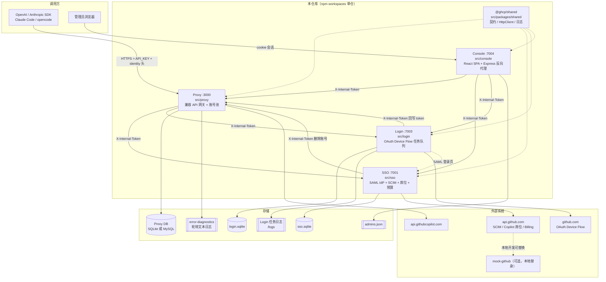
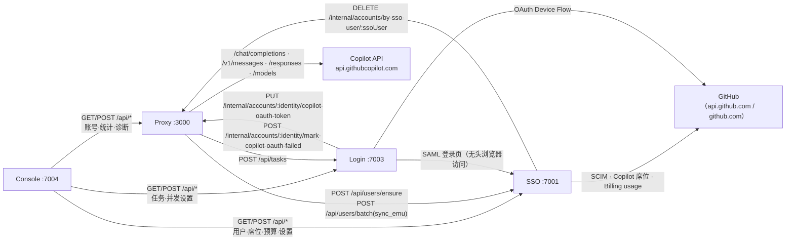
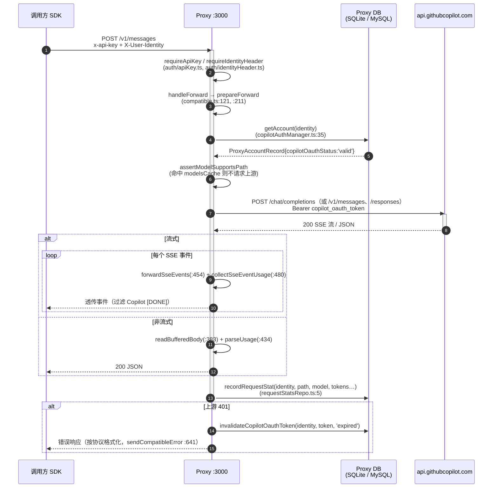
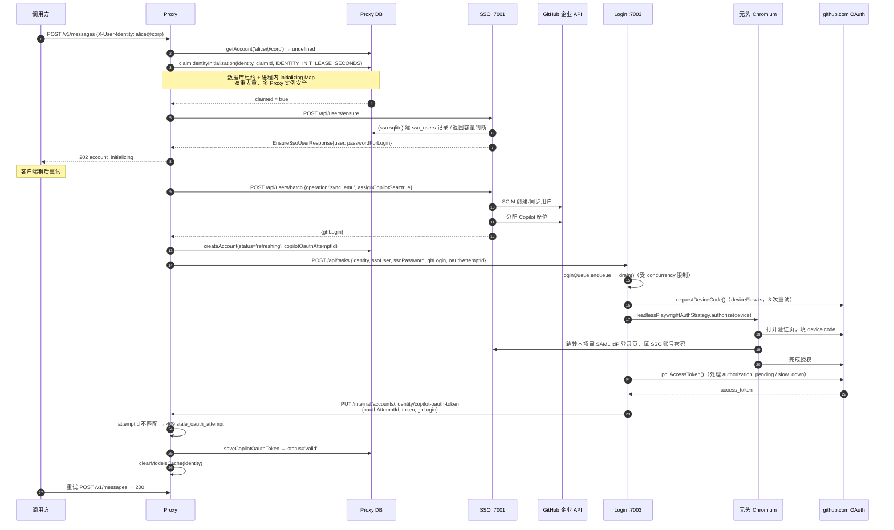
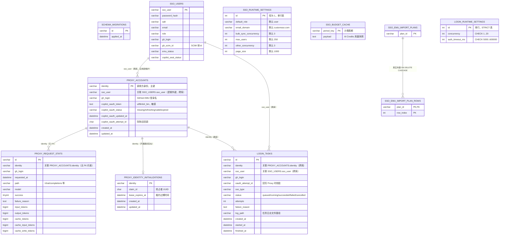

# 代码导读（Codebase Overview）

> 面向新加入项目的高级开发人员。本文所有结论均来自对实际源码与配置文件的阅读，并在每条结论后标注了 `文件路径:行号` 或关键符号。
> 无法从代码中确证的内容统一标记为 **待确认**。

---

## 1. 项目用途、技术栈与启动入口

### 1.1 项目用途

这是一个 **GitHub Copilot 企业账号池 + OpenAI/Anthropic 兼容 API 网关**。它做三件事：

1. 对外暴露 OpenAI / Anthropic Messages / OpenAI Responses 三种兼容协议的推理端点，转发到 GitHub Copilot 内部 API（`https://api.githubcopilot.com`，见 `src/proxy/src/config.ts:60` 的 `copilotApiBaseUrl`）。
2. 为每个调用方身份（identity）**自动开通**一个 GitHub Enterprise Managed User（EMU）账号：自建 SAML IdP 完成 SSO → SCIM 在企业里建用户 → 分配 Copilot 席位 → 用无头浏览器跑 GitHub OAuth Device Flow 拿到 Copilot OAuth token。
3. 提供一个管理 Console（SPA + 反向代理），统一查看/操作用户、账号、登录任务、请求统计、AI Credits 用量和错误诊断。

关键证据：`src/proxy/src/copilot/copilotAuthManager.ts:128` `initializeEnsuredIdentity()` 串起了「ensureSsoUser → syncEmuUser(assignCopilotSeat) → createAccount(status=refreshing) → createLoginTask」这条自动开通链路。

### 1.2 技术栈

| 层 | 技术 | 证据 |
| --- | --- | --- |
| 运行时 | Node.js 22（Docker 基础镜像 `node:22-bookworm-slim`） | `src/proxy/Dockerfile:1` |
| 模块系统 | ESM（`"type": "module"`，全部相对导入带 `.js` 后缀） | 根 `package.json`；`src/proxy/src/server.ts:4` `from './config.js'` |
| 语言 | TypeScript 5.7，`tsx` 跑开发态、`tsc` 出构建产物 | 根 `package.json` scripts |
| 仓库结构 | npm workspaces 单仓多包 | 根 `package.json` `workspaces: ["src/packages/*", "src/proxy", "src/sso", "src/login", "src/console", "src/mock-github"]` |
| HTTP | Express 5 | 各服务 `server.ts` |
| Proxy 存储 | `better-sqlite3`（WAL）**或** `mysql2/promise` 连接池，二选一 | `src/proxy/src/db/connection.ts:11` `getStorage()` |
| SSO / Login 存储 | SQLite（`better-sqlite3`），单实例 | `src/sso/src/db/migrations.ts`、`src/login/src/db/migrations.ts` |
| Console 存储 | 单个 JSON 文件（管理员账号） | `src/console/src/server/adminsStore.ts:46,56`，路径来自 `config.adminsFile`（默认 `./data/admins.json`，写入时 `mode: 0o600`） |
| SAML | `samlify`（自建 IdP + 自建 SP，同进程内互相签发） | `src/sso/src/saml/saml.ts:65` `samlify.IdentityProvider(...)`、`:79` `samlify.ServiceProvider(...)` |
| 浏览器自动化 | `playwright-extra` + stealth 插件（无头 Chromium） | `src/login/src/auth/HeadlessPlaywrightAuthStrategy.ts` |
| 前端 | React 19 + Vite 7 + Tailwind 4 单页应用 | `src/console/src/web/App.tsx`（2272 行，单文件承载全部页面） |
| 会话 | `cookie-session`（SSO 用 `sso_session`，Console 用 `console_session`） | `src/console/src/server/index.ts:13`；`src/sso/src/server.ts` |

### 1.3 启动入口

| 服务 | 入口文件 | 默认端口 | 开发命令 |
| --- | --- | --- | --- |
| Proxy | `src/proxy/src/index.ts` → `startServer()`（`src/proxy/src/server.ts:109`） | 3000（`src/proxy/src/config.ts:33`） | `npm run start:proxy` |
| SSO | `src/sso/src/index.ts` → `startServer()` | 7001 | `npm run start:sso` |
| Login | `src/login/src/index.ts` → `startServer()` | 7003 | `npm run start:login` |
| Console | `src/console/src/server/index.ts:84`（**没有单独的 index 包装，`buildApp().listen()` 直接写在模块底部**） | 7004（`src/console/src/server/config.ts`） | `npm run start:console` |
| Mock GitHub | `src/mock-github/src/server.ts` | **待确认**（未读取该文件的端口配置） | `npm run start:mock-github` |

生产入口是各 workspace 的 `start:prod`，Dockerfile 里 `CMD ["npm", "--workspace", "@ghcp/proxy", "run", "start:prod"]`（`src/proxy/Dockerfile:12`）。

Proxy 的启动顺序值得注意（`src/proxy/src/server.ts:109-128`）：先 `initializeStorage()`（建表/跑迁移）→ 再 `pruneAllRequestStats()`（按每账号保留条数裁剪历史）→ 最后才 `listen()`。任一步失败都会 `closeStorage()` 后抛出，不会带病启动。

---

## 2. 仓库包含哪些服务与核心模块

### 2.1 系统架构图



### 2.2 各服务/模块职责

#### `src/proxy`（@ghcp/proxy，:3000）—— 核心

对外网关 + 账号池。中间件与挂载顺序见 `src/proxy/src/server.ts:18-56`：

```ts
app.use(logRequestHeaders);          // 脱敏后打印原始请求头
app.use(captureRawRequestBody);      // 旁路收集 req.rawBody（转发时原样透传）
app.use(express.json({ limit: '20mb' }));
app.get('/healthz', ...);            // 存活
app.get('/readyz', ...);             // 就绪：pingStorage() + 回显 storage 驱动名
app.use('/api',      requireInternalToken, adminApiRouter);     // 给 Console 用
app.use('/internal', requireInternalToken, internalApiRouter);  // 给 Login/SSO 用
app.use(requireApiKey, requireIdentityHeader, compatibleRouter); // 对外公开 API
```

子模块：
- `routes/compatible.ts`（719 行）：公开 API。`GET /v1/models`（:50）、`POST /chat/completions`（:82）、`POST /responses`（:86）、`POST /v1/messages/count_tokens`（:90）、`POST /v1/messages`（:100）；`/v1/files` 统一返回 404 `not_supported`（`handleFilesApiUnsupported`，:106）。
- `routes/adminApi.ts`：Console 面向的管理 API（账号、请求统计、错误诊断、导入 token、重新授权）。
- `routes/internalApi.ts`：服务间回调，`PUT /accounts/:identity/copilot-oauth-token`、`POST /accounts/:identity/mark-copilot-oauth-failed`、`DELETE /accounts/by-sso-user/:ssoUser`。
- `copilot/copilotAuthManager.ts`：身份初始化状态机（详见 §4.2）。
- `copilot/copilotClient.ts`：与 Copilot 上游的实际 HTTP 交互 + 模型列表缓存。
- `db/`：双存储后端（详见 §5）。
- `diagnostics/`：错误诊断落盘（详见 §6.4）。
- `auth/`：`requireApiKey`（`x-api-key` 或 `Authorization: Bearer`）、`requireIdentityHeader`、`requireInternalToken`。

#### `src/sso`（:7001）

企业身份中枢，四类能力：
- **SAML IdP**：`src/sso/src/saml/saml.ts` 用 samlify 同时构造 IdP 与 SP；`metadataXml()`（:87）、`parseAuthnRequest()`（:91）、`buildSamlResponse()`（:101）。路由 `GET /metadata`、`GET /sso`、`GET|POST /login`、`POST /logout`。
- **SCIM 用户供给**：`src/sso/src/scim/scimClient.ts:147` 统一 `fetch(\`${scimBase()}${path}\`)`，`scimBase()` 取 `config.scimBaseUrl`，缺省回落到 mock-github。
- **Copilot 席位**：`src/sso/src/copilot/seats.ts:84,88` 调 `/enterprises/{slug}/copilot/billing/selected_users` 与 `/copilot/billing/seats`。
- **AI Credits 预算**：`src/sso/src/budget/budgetService.ts:50` 调 `/enterprises/{slug}/settings/billing/usage/summary`。

业务逻辑集中在 `src/sso/src/users/service.ts`：`ensureUser()`、`getSsoUserCapacity()`、`createSsoUser()`、`patchSsoUser()`、`deleteSsoUser()`、`syncSsoUser()`、`suspendSsoUser()`、`deleteEmuUser()`、`runSsoUserBatch()`、CSV `importUsers()`。

⚠️ 注意 `runSsoUserBatch()`：**只有 `sync_emu` 走 `mapWithConcurrency(..., bulkSyncConcurrency, ...)` 并发**，其他批量操作是串行的。

#### `src/login`（:7003）

无头浏览器登录工厂。`src/login/src/server.ts:16` 把全部 API 挂在 `/api` 下并统一要求内部 token：

```ts
app.use('/api', requireInternalToken, tasksApiRouter, settingsApiRouter);
```

- `routes/tasksApi.ts`：`GET /tasks`（:9）、`POST /tasks`（:28）、`GET /tasks/:id`（:37）、`POST /tasks/:id/cancel`（:46）、`DELETE /tasks/:id`（:55）、`POST /tasks/:id/retry`（:68）。
- `routes/settingsApi.ts`：`GET /settings/runtime`（:23）、`PATCH /settings/runtime`（:27）。
- `tasks/queue.ts`：`class LoginQueue`，`pending: RuntimeTaskPayload[]` / `active: Set<string>` / `cancelled: Set<string>`，`drain()` 在 `active.size < getConcurrency()` 时持续取任务；导出单例 `loginQueue`。
- `tasks/runner.ts`：`runLoginTask()` → `markRunning` → `loginWithDeviceFlow(new HeadlessPlaywrightAuthStrategy(...))` → `saveCopilotOauthToken(...)` 回写 Proxy → `markSuccess`/`markFailed`。
- `auth/deviceFlow.ts`：`requestDeviceCode()`（3 次重试）→ `strategy.authorize(device)` → `pollAccessToken()`，处理 `authorization_pending` / `slow_down` / `expired_token` / `access_denied`。

#### `src/console`（:7004）

React SPA + 极薄的 Express BFF。服务端只做三件事：管理员登录态、把 `/api/console/*` 转发到三个后端、托管静态资源与 SPA fallback（`src/console/src/server/index.ts:71-79`）。

前端页面清单（`src/console/src/web/App.tsx:35`）：
```ts
type Page = 'dashboard' | 'users' | 'budgets' | 'stats' | 'accounts' | 'tasks' | 'settings' | 'error-diagnostics' | 'diagnostics';
```
路由通过 URL hash 驱动（`readPageFromHash()`，:117-133），不是 React Router。

#### `src/packages/shared`（@ghcp/shared）

被四个服务共同依赖，`src/packages/shared/src/index.ts` 全量再导出：`api.js`（`INTERNAL_AUTH_HEADER = 'X-Internal-Token'`、`ApiErrorResponse`、`PageResponse<T>`、`BatchResult<Row>`、`HttpApiError`、`apiError()`、`pageResponse()`）、`contracts.js`（跨服务 DTO）、`httpClient.js`、`ids.js`、`logger.js`、`redact.js`、`time.js`。

`src/packages/shared/src/httpClient.ts` 的 `JsonHttpClient.request()` 是所有服务间调用的唯一通道：自动注入 `X-Internal-Token`、`AbortSignal.timeout(options.timeoutMs ?? 30_000)`、把非 2xx 转成 `HttpApiError(status, code, message, details)`。

#### `src/mock-github`

本地开发替身，实现 SCIM 端点（`src/mock-github/src/server.ts:71-154`：`GET/POST /scim/v2/enterprises/:enterprise/Users`、`PUT/PATCH/DELETE .../Users/:id`）。**待确认**：是否也 mock 了 Copilot 席位与 Billing 端点（本次未逐行读完该文件）。

---

## 3. 服务之间如何通信

**结论：全部是同步 HTTP + JSON，没有 RPC、没有消息中间件、没有共享数据库。** 服务间调用一律带 `X-Internal-Token` 头。

### 3.1 三种鉴权边界

| 边界 | 机制 | 代码 |
| --- | --- | --- |
| 外部调用方 → Proxy 公开 API | `API_KEY`，走 `x-api-key` 或 `Authorization: Bearer` | `src/proxy/src/auth/apiKey.ts` `requireApiKey` |
| 外部调用方 → Proxy 身份识别 | `IDENTITY_HEADER`（默认 `X-User-Identity`）；`IDENTITY_HEADER_REQUIRED=false` 时回落到 `'default'` | `src/proxy/src/auth/identityHeader.ts`；`src/proxy/src/config.ts:41-42` |
| 服务 ↔ 服务 | 共享密钥 `INTERNAL_API_TOKEN`，头名 `X-Internal-Token` | `src/packages/shared/src/api.ts:1`；各服务 `auth/internalAuth.ts` |
| 管理员 → Console | `cookie-session`（`console_session`，8 小时，httpOnly，sameSite=lax） | `src/console/src/server/index.ts:13` |

Console 自身**不直接访问任何后端数据库**，而是靠 `serviceProxy(target, mountPath)`（`src/console/src/server/apiProxy.ts`）把路径重写成 `${baseUrl}/api${suffix}` 并注入内部 token，失败时统一返回 502 `service_proxy_failed`：

```ts
app.use('/api/console/proxy',         requireAdmin, serviceProxy('proxy', '/api/console/proxy'));
app.use('/api/console/sso',           requireAdmin, serviceProxy('sso', '/api/console/sso'));
app.use('/api/console/login-service', requireAdmin, serviceProxy('login', '/api/console/login-service'));
```
（`src/console/src/server/index.ts:71-73`）

### 3.2 服务依赖图



**存在双向依赖**：Proxy → Login（下发任务）与 Login → Proxy（回写 token）。这是设计使然：Proxy 立刻返回 202 不阻塞，Login 异步完成后回调。`docker-compose.yml` 因此不能让二者互为 `depends_on`——实际是 `proxy` 依赖 `sso` + `login` healthy，而 Login 通过 `PROXY_BASE_URL` 在运行时按需连接。

Compose 里服务地址是硬编码的容器名（`docker-compose.yml`）：`PROXY_BASE_URL: http://proxy:3000`、`SSO_BASE_URL: http://sso:7001`、`LOGIN_BASE_URL: http://login:7003`。

Proxy 侧的客户端封装在 `src/proxy/src/clients/ssoClient.ts`：`ensureSsoUser` → `POST /api/users/ensure`；`syncEmuUser` → `POST /api/users/batch`，body 为 `{ operation: 'sync_emu', ssoUsers: [ssoUser], assignCopilotSeat }`。

---

## 4. 典型请求的完整流转

### 4.1 已就绪账号的推理请求（happy path）

调用链（全部在 `src/proxy/src/routes/compatible.ts`）：

`compatibleRouter.post('/v1/messages')`（:100）
→ `handleForward(req, res, path)`（:121）
→ `prepareForward(...)`（:211，做 Claude Code 兼容改写）
→ `forwardAuthenticated(...)`（:239）
  → `copilotAuthManager.getAuth(identity)` → `assertModelSupportsPath` → `prepareCopilotRequest` → `executePreparedCopilotRequest`
  → 上游返回 401 时调用 `copilotAuthManager.invalidate(identity, token)` 使 token 失效
→ `pipeAndRecord(...)`（:268）
  → 非流式：缓冲整段 JSON；流式：`forwardSseEvents()`（:454）逐事件透传，`collectSseEventUsage()`（:480）抽取 usage，`isCopilotDoneEvent()`（:509）过滤掉 Copilot 特有的 `[DONE]` 事件
  → `recordRequestStat(...)`（`src/proxy/src/db/requestStatsRepo.ts:5`）写统计
  → 失败时写错误诊断文件



### 4.2 首次见到的 identity（冷启动自动开通）

这是本项目最有价值的一条链路。`src/proxy/src/copilot/copilotAuthManager.ts:34-62` 的 `getAuth()` 是一个**非阻塞状态机**——它从不等待开通完成，而是立刻抛 `CopilotAuthNotReadyError` 让调用方重试：

| 账号状态 | HTTP 状态 | code |
| --- | --- | --- |
| 账号不存在 → 触发初始化 | 202 | `account_initializing` |
| `copilotOauthStatus === 'refreshing'` | 202 | `account_initializing` |
| token 缺失或状态非 valid | 503 | `oauth_not_ready` |
| SSO 返回 `sso_user_limit_reached` | 409 | `account_limit_reached`（:40-42） |



关键实现细节：
- **幂等/去重**：`beginIdentityInitialization()`（:93）先查进程内 `initializing` Map，再用 `claimIdentityInitialization(identity, claimId, config.identityInitLeaseSeconds)` 抢数据库租约；抢不到直接 `return`（:99）——这就是多 Proxy 实例不会重复开通同一身份的原因。`finally` 里 `releaseIdentityInitialization(identity, claimId)`（:117）。
- **陈旧回调防护**：Login 回写 token 时携带 `oauthAttemptId`，若与当前记录不一致，`internalApi.ts` 返回 409 `stale_oauth_attempt`。这防止「旧任务晚到覆盖新 token」。
- **identity → ssoUser 映射**：`ssoUserFromIdentity()`（:160）小写化、去掉 `@` 后缀、非法字符替 `-`、剥掉企业短代码后缀（`stripEnterpriseShortcode`，:170）、截断 32 字符。
- **失败路径**：任一步失败都会调 `failCopilotOauthAuthorization(identity, oauthAttemptId)`（:141、:154）把状态回退；Login 侧失败则调 `markCopilotOauthFailed()`（`src/login/src/tasks/queue.ts`）。

---

## 5. 核心数据实体、数据库表与关系

### 5.1 三个物理隔离的数据库

**没有跨库外键，也没有跨服务的 JOIN。** 表之间的关联全靠业务字段（`identity` / `sso_user`）在应用层拼接。

| 数据库 | 归属 | 后端 | 表 |
| --- | --- | --- | --- |
| Proxy DB | `src/proxy` | **SQLite 或 MySQL 二选一** | `schema_migrations`、`proxy_accounts`、`proxy_request_stats`、`proxy_identity_initializations` |
| `sso.sqlite` | `src/sso` | 仅 SQLite（单实例） | `sso_users`、`sso_runtime_settings`、`sso_budget_cache`、`sso_emu_import_plans`、`sso_emu_import_plan_rows` |
| `login.sqlite` | `src/login` | 仅 SQLite（单实例） | `login_tasks`、`login_runtime_settings` |
| `admins.json` | `src/console` | JSON 文件 | 管理员账号（非数据库） |

### 5.2 ER 图



**注**：ER 图中只有 `SSO_EMU_IMPORT_PLANS → SSO_EMU_IMPORT_PLAN_ROWS` 是数据库层面的真外键（`ON DELETE CASCADE`，`src/sso/src/db/migrations.ts`）。其余关系均为**逻辑关系**，由应用代码维护。这也解释了为什么删用户要走 `deleteSsoUser()` 那条编排链：移除席位 → SCIM 删除 → `deleteProxyAccountsBySsoUser`（跨服务 HTTP）→ 本地删除（`src/sso/src/users/service.ts`）。

### 5.3 Proxy 双存储后端

这是 Proxy 最重要的架构特征。抽象在 `src/proxy/src/db/storageTypes.ts` 的 `ProxyStorage` 接口：

```
initialize / ping / close
listAccounts / getAccount / deleteAccount / deleteAccountsBySsoUser / createAccount
importCopilotOauthToken / saveCopilotOauthToken / markCopilotOauthStatus
beginCopilotOauthAuthorization / failCopilotOauthAuthorization / invalidateCopilotOauthToken
claimIdentityInitialization / releaseIdentityInitialization
recordRequestStat / listRequestStats / pruneAllRequestStats
```

两个实现：`src/proxy/src/db/sqliteStorage.ts` 与 `src/proxy/src/db/mysqlStorage.ts`。选择在 `src/proxy/src/db/connection.ts:11` `getStorage()`：`STORAGE_DRIVER=mysql` 时走 `createMysqlStorage()`（:42，用 `createPool`），否则 `new SqliteStorage(config.dbPath, config.requestStatsPerAccountLimit)`。

`src/proxy/src/db/accountsRepo.ts` 和 `requestStatsRepo.ts` 是极薄的转发层（每个函数 3-5 行，都只是 `getStorage().xxx()`），业务代码永远不直接接触任何一种驱动。

**两者的差异不只是驱动**：

| 维度 | SQLite | MySQL |
| --- | --- | --- |
| 迁移协调 | 进程内直接建表（`src/proxy/src/db/migrations.ts`） | `SELECT GET_LOCK('ghcp_proxy_schema_migrations', 30)` 咨询锁，`finally` 中 `RELEASE_LOCK`（`src/proxy/src/db/mysqlMigrations.ts:11-16, 86-91`） |
| 表引擎 | WAL 模式 | InnoDB + utf8mb4，token 列 `COLLATE utf8mb4_bin`（大小写敏感） |
| 索引 | `idx_proxy_request_stats_identity_time(identity, requested_at DESC)` | 额外有 `idx_proxy_accounts_sso_user`、`idx_proxy_accounts_updated_at`、`idx_proxy_request_stats_time` |
| 迁移记录 | `'2026-07-23-copilot-oauth-direct'`（删除遗留 token 列） | `'2026-08-27-proxy-mysql-initial'`、`'2026-08-27-proxy-token-binary-collation'` |
| 实例数 | 只能单实例 | 可多实例 |

MySQL 版 `claimIdentityInitialization`（`src/proxy/src/db/mysqlStorage.ts:262`）用 `INSERT IGNORE` + 冲突时 `UPDATE ... WHERE identity = ? AND lease_expires_at <= ?`，并对可重试的锁错误做最多 3 次重试——这是多实例并发抢占身份初始化权的核心。SQLite 版对应实现在 `sqliteStorage.ts:254`（`releaseIdentityInitialization` 在 :271，`pruneAllRequestStats` 在 :315）。

TLS 处理见 `connection.ts:42` `createMysqlStorage()`：`required` → `ssl = { rejectUnauthorized: false }`；`verify-ca` → `{ ca: readFileSync(config.mysqlSslCaPath), rejectUnauthorized: true }`。

⚠️ **已发现的文档/代码不一致**：`src/proxy/.env.example:7` 写的是 `MYSQL_SSL_MODE=disabled | required | verify_ca`（下划线），但 `src/proxy/src/config.ts:97` 的 `readMysqlSslMode()` 只接受 `verify-ca`（连字符），传下划线会在启动时抛错。以代码为准。

---

## 6. 缓存、消息队列、定时任务与外部系统

### 6.1 缓存

**全部是进程内缓存，没有 Redis / Memcached。**

| 缓存 | 位置 | 策略 |
| --- | --- | --- |
| 模型列表 | `src/proxy/src/copilot/copilotClient.ts` `modelsCache = new Map<ModelsCacheKey, ModelsCacheEntry>()` | `MODELS_CACHE_TTL_MS = 60*60*1000`（1 小时）；`MODELS_CACHE_STALE_MAX_AGE_MS = 6*60*60*1000`（上游故障时最长供 6 小时陈旧数据）；`MODELS_CACHE_NEGATIVE_RECHECK_MS = 60*1000`（失败后 1 分钟重试）。token 更新时由 `internalApi.ts` 调 `clearModelsCache(identity)` 主动失效 |
| SSO 运行时设置 | `src/sso` 内存快照 | 见 `sso_runtime_settings` 单行表 |
| Login 运行时设置 | `src/login` 内存快照 | 见 `login_runtime_settings` 单行表 |
| AI Credits 用量 | **数据库表** `sso_budget_cache`（PK `period_key`） | 唯一持久化缓存；可通过 `POST /api/ai-credits/usage/refresh` 强制刷新 |

**多实例影响（待确认的运维含义）**：三个进程内缓存在多 Proxy 实例下各自独立，`clearModelsCache` 只对本实例生效。实践中影响有限（TTL 1 小时），但如果对「刚导入 token 立即可用」有强要求，需注意其他实例最长 1 小时后才刷新。

### 6.2 消息队列

**没有外部消息中间件（无 Kafka / RabbitMQ / Redis Queue / BullMQ）。** 唯一的队列是进程内的 `LoginQueue`（`src/login/src/tasks/queue.ts`），状态持久化在 `login_tasks` 表，队列本身（`pending` 数组）是内存态。

含义：Login 服务重启后，内存队列丢失，需要靠 `login_tasks` 表里的状态 + `POST /tasks/:id/retry` 恢复。**待确认**：启动时是否会自动把 `queued`/`running` 状态的任务重新入队（本次未读到这段逻辑）。

### 6.3 定时任务

**代码中不存在任何定时任务。** 已对 `src/*/src` 全量 grep `cron` / `setInterval` / 调度库，均无命中。所有周期性行为都是**事件驱动或启动时一次性**的：

- `pruneAllRequestStats()` 只在 Proxy **启动时**调用一次（`src/proxy/src/server.ts:113`）。
- 请求统计的裁剪还发生在每次 `recordRequestStat` 之后（受 `REQUEST_STATS_PER_ACCOUNT_LIMIT` 控制，默认 **2**，见 `src/proxy/src/config.ts:50`）。
- `proxy_identity_initializations` 的租约靠 `lease_expires_at <= now` 的**惰性过期**（下一个抢占者顺手接管），而不是清理任务。
- 错误诊断文件轮转在写入时触发（`src/proxy/src/diagnostics/errorDiagnosticsStore.ts:50` `await this.rotate(directory)`）。

⚠️ `REQUEST_STATS_PER_ACCOUNT_LIMIT` 默认值是 `2`——即**每个账号默认只保留 2 条请求统计**。这个默认值极小，生产环境几乎肯定要调大。

### 6.4 外部系统

| 外部系统 | 用途 | 调用点 |
| --- | --- | --- |
| `api.githubcopilot.com` | 推理转发 | `src/proxy/src/copilot/copilotClient.ts`，`COPILOT_API_PATHS = ['/chat/completions','/v1/messages','/responses']`，`COPILOT_FORWARD_PATHS` 额外含 `/v1/messages/count_tokens` |
| GitHub SCIM API | 企业用户供给 | `src/sso/src/scim/scimClient.ts:147` |
| GitHub Copilot Billing API | 席位分配/回收 | `src/sso/src/copilot/seats.ts:84,88` |
| GitHub Enterprise Billing API | AI Credits 用量 | `src/sso/src/budget/budgetService.ts:50` |
| `github.com` OAuth Device Flow | 获取 Copilot OAuth token | `src/login/src/auth/deviceFlow.ts` |
| 无头 Chromium | 驱动 Device Flow 的浏览器交互 | `src/login/src/auth/HeadlessPlaywrightAuthStrategy.ts`（`playwright-extra` + stealth） |
| mock-github | 本地替代 SCIM | `src/mock-github/src/server.ts:71-154` |

**错误诊断不落库**：`src/proxy/src/diagnostics/errorDiagnosticsStore.ts` 用 `appendFile` 写轮转文本日志（默认目录 `./data/error-diagnostics`，单文件 50MB、保留 5 个，见 `config.ts:53-56`）。多实例部署时需要 `PROXY_ERROR_DIAGNOSTICS_SHARED=true` + `PROXY_INSTANCE_ID`（`config.ts:57-60`，instanceId 回落顺序为 `PROXY_INSTANCE_ID` → `HOSTNAME` → `'proxy'`）。

---

## 7. 配置、构建、测试与部署

### 7.1 配置

每个服务一个 `config.ts`，模式统一：`import 'dotenv/config'` → 导出一个冻结的 `config` 对象 → **在模块顶层做校验，配置非法直接抛错**（fail fast）。

以 `src/proxy/src/config.ts` 为例，校验函数有 `readPort`（:73）、`readPositiveInteger`（:79）、`readBoolean`（:84）、`readStorageDriver`（:91）、`readMysqlSslMode`（:97）、`readOptionalString`（:104）。跨字段校验在 :66-71：

```ts
if (config.storageDriver === 'mysql' && !config.mysqlUrl) throw new Error('MYSQL_URL is required when STORAGE_DRIVER=mysql.');
if (config.mysqlSslMode === 'verify-ca' && !config.mysqlSslCaPath) throw new Error('MYSQL_SSL_CA_PATH is required when MYSQL_SSL_MODE=verify-ca.');
```

Proxy 配置项全貌（`ProxyConfig` 接口，`config.ts:3-30`）分五组：端口、存储（`storageDriver`/`dbPath`/`mysql*`/`identityInitLeaseSeconds`）、鉴权（`apiKey`/`identityHeader`/`identityHeaderRequired`/`internalApiToken`）、服务地址（`ssoBaseUrl`/`loginBaseUrl`）、行为与诊断（`claudeCodeOptimized`/`enterpriseShortcode`/`requestStatsPerAccountLimit`/`errorDiagnostics*`/`copilotApiBaseUrl`/`opencodeUserAgent`/`githubApiVersion`）。

几个容易踩的默认值：

| 配置 | 默认值 | 说明 |
| --- | --- | --- |
| `STORAGE_DRIVER` | `sqlite` | `config.ts:34` |
| `DB_PATH` | `./data/proxy.sqlite` | `config.ts:35` |
| `MYSQL_CONNECTION_LIMIT` | `10` | `config.ts:36` |
| `IDENTITY_INIT_LEASE_SECONDS` | `900`（15 分钟） | `config.ts:39` |
| `IDENTITY_HEADER` | `X-User-Identity` | `config.ts:41` |
| `IDENTITY_HEADER_REQUIRED` | `true` | `config.ts:42` |
| `REQUEST_STATS_PER_ACCOUNT_LIMIT` | **`2`** | `config.ts:50`，见 §6.3 警告 |
| `ENTERPRISE_SHORTCODE` | `octo` | `config.ts:49` |
| `SESSION_SECRET`（Console） | **`dev-secret-change-me`** | `src/console/src/server/config.ts`，生产必须覆盖 |

参考文件：根 `.env.example`、`src/proxy/.env.example`。

### 7.2 构建

根 `package.json` scripts：

| 命令 | 作用 |
| --- | --- |
| `npm run build` | 全量构建（`@ghcp/shared` 必须先构建，其他 workspace 依赖其 `dist`） |
| `npm run build:deploy` | 部署用构建 |
| `npm run typecheck` / `typecheck:upgrade` | 类型检查（后者覆盖 `upgrade/` 目录） |
| `npm run start:{proxy,sso,login,console,mock-github}` | 开发态（tsx） |
| `npm run start:prod:*` | 生产态（跑 `dist`） |
| `npm run compose:build / compose:up / compose:down` | Docker Compose |
| `npm run mysql:test:up / mysql:test:down` | 拉起/销毁本地测试用 MySQL |
| `npm run upgrade:sqlite-to-mysql` | 数据迁移工具 |
| `npm run validate:health` | 健康检查脚本（`scripts/validate-health.sh`） |

Dockerfile 是**单阶段**的（`src/proxy/Dockerfile`）：`npm ci` → 构建 shared → 构建本服务 → `npm prune --omit=dev`。四个服务的 Dockerfile 结构相同，只是 workspace 名和端口不同。

### 7.3 测试

⚠️ **根 `package.json` 没有 `test` 脚本**。测试必须按 workspace 跑，用的是 Node 内置 test runner（`tsx --test`）：

| workspace | 命令 |
| --- | --- |
| proxy | `npm --workspace @ghcp/proxy run test` → `tsx --test src/accounts/*.test.ts src/clients/*.test.ts src/copilot/*.test.ts src/db/*.test.ts src/diagnostics/*.test.ts src/routes/*.test.ts` |
| proxy（MySQL 集成） | 根 `npm run test:mysql`，配合 `mysql:test:up`；对应 `src/proxy/src/db/mysqlStorage.integration.test.ts` |
| sso | `tsx --test src/copilot/*.test.ts src/db/*.test.ts src/users/*.test.ts` |
| login | `tsx --test src/auth/*.test.ts src/db/*.test.ts` |
| console | `tsx --test src/server/*.test.ts`（`pretest` 会先构建 `@ghcp/shared`） |
| 迁移工具 | 根 `npm run test:upgrade:mysql` → `upgrade/sqlite-to-mysql/migrate.integration.test.ts` |

测试集中在**存储层、契约层和纯函数**（如 `src/proxy/src/db/*.test.ts`、`src/proxy/src/diagnostics/errorDiagnostics.test.ts`、`src/console/src/server/apiProxy.test.ts`）。**待确认**：没有看到端到端测试或前端（`src/console/src/web`）的测试。

### 7.4 部署

`docker-compose.yml` 定义 4 个服务，用 healthcheck 门控启动顺序：

| 服务 | 端口 | 卷 | depends_on |
| --- | --- | --- | --- |
| `sso` | 7001 | `sso-data:/data`、`${SSO_CERT_DIR}:/certs:ro` | — |
| `login` | 7003 | `login-data:/data`、`login-logs:/logs` | — |
| `proxy` | 3000 | `proxy-data:/data` | `sso` + `login` 均 healthy；自身 healthcheck 打 `/readyz` |
| `console` | 7004 | `console-data:/data` | 三者均 healthy |

MySQL 模式需要叠加第二个 compose 文件：`docker-compose.mysql.yml`（`docker compose -f docker-compose.yml -f docker-compose.mysql.yml up`）。

**SQLite → MySQL 迁移**是显式的一次性操作，Proxy 启动时**绝不**自动搬运数据（`upgrade/sqlite-to-mysql/README.md:3`）。流程：用 sqlite 驱动启一次让 schema 到最新 → 停 Proxy 和 Login → 备份 `proxy.sqlite` 及 `-wal`/`-shm` → 建空 MySQL 库 → `--dry-run` 预检 → 正式迁移（事务内复制 `proxy_accounts` 与 `proxy_request_stats`，提交前校验行数，拒绝写入非空目标库）→ 切 `STORAGE_DRIVER=mysql` → 等 `/readyz` → 扩容 → 重启 Login。回滚是恢复 SQLite 备份并退回单实例（`README.md:44`）。

健康检查语义区分明确：`/healthz` 只表示进程活着（`server.ts:23`），`/readyz` 会真正 `pingStorage()` 并回显当前驱动（`server.ts:26-36`）：

```json
{"status":"ok","service":"proxy","storage":"sqlite"}
```

优雅停机：`SIGTERM`/`SIGINT` → `server.close()` + `closeStorage()`，并有 25 秒强制关闭定时器（`server.ts:129-150`）。

更详细的运维手册见 `guidance/guidance.md`（尤其 §6.1.2 讲两种数据库后端的选择）。

---

## 8. 建议的代码阅读顺序

### 第 1 天：建立骨架认知（约 2 小时）

1. **根 `package.json`** —— 先看 `workspaces` 和 scripts，理解这是单仓多包，以及每个服务怎么起。
2. **`docker-compose.yml`** —— 看服务拓扑、端口、卷、`depends_on`。这是最快建立"有哪几个进程、它们怎么找到彼此"的方式。
3. **`src/packages/shared/src/api.ts` + `httpClient.ts`** —— 只有 ~100 行，但定义了整个系统的调用契约：`INTERNAL_AUTH_HEADER`、`HttpApiError`、`PageResponse<T>`、`BatchResult<Row>`。后面所有服务间调用都长这样。
4. **`src/proxy/src/server.ts`** —— 全仓最值得精读的单文件。`buildApp()` 的 18 行中间件栈把 Proxy 的三层 API 边界（公开 / `/api` / `/internal`）一眼讲清；`startServer()` 讲清启动与停机契约。

### 第 2 天：主链路（约 3 小时）

5. **`src/proxy/src/config.ts`** —— 全部配置项 + 校验规则，读完就知道有哪些旋钮。
6. **`src/proxy/src/routes/compatible.ts`** —— 从 `handleForward`(:121) 顺着读到 `pipeAndRecord`(:268)。前 300 行是主干，300 行之后是 SSE 解析与 usage 提取的工具函数，第一遍可以跳过。
7. **`src/proxy/src/copilot/copilotAuthManager.ts`** —— **全仓概念密度最高的 180 行**。`getAuth()` 的四种状态、`beginIdentityInitialization()` 的双重去重、`initializeEnsuredIdentity()` 的四步编排。不读懂这个文件就不算理解这个项目。
8. **`src/proxy/src/db/storageTypes.ts`** —— `ProxyStorage` 接口就是 Proxy 的全部持久化能力清单，比读任何一个实现都高效。

### 第 3 天：存储与身份（约 3 小时）

9. **`src/proxy/src/db/connection.ts`**（60 行）→ **`migrations.ts`** → **`mysqlMigrations.ts`** —— 按这个顺序读，先看驱动怎么选，再对比两套 schema 的差异（尤其 `GET_LOCK` 那段）。
10. **`src/proxy/src/db/accountsRepo.ts`** —— 每个函数 3-5 行的转发层，5 分钟扫完，但能建立"业务代码永不接触驱动"的认知。
11. **`src/sso/src/users/service.ts`** —— SSO 的全部业务逻辑，特别注意 `deleteSsoUser()` 的四步跨服务编排和 `runSsoUserBatch()` 的并发差异。
12. **`src/sso/src/db/migrations.ts`** —— 五张表的完整定义。

### 第 4 天：异步侧与前端（约 2 小时）

13. **`src/login/src/tasks/queue.ts` → `runner.ts` → `auth/deviceFlow.ts`** —— 按这个顺序读，从"怎么调度"到"一个任务做什么"到"OAuth 协议细节"，层层下沉。
14. **`src/console/src/server/apiProxy.ts`**（很短）+ **`index.ts`** —— 理解 Console 只是个带鉴权的转发器，不碰数据库。
15. **`src/console/src/web/App.tsx:35-181`** —— 只读 `type Page` 和 `navigate`/页面分发那 150 行，就掌握了全部功能入口；2272 行的其余部分按需查。

### 第 5 天：验证理解

16. 起本地环境（`mock-github` + 四个服务），用一个新 identity 发一次请求，观察 202 → 轮询 → 200 的完整过程，对照 §4.2 的时序图。
17. 跑一遍 `npm run mysql:test:up && npm run test:mysql`，理解双后端的等价性是怎么被测试保证的。
18. 读 `guidance/guidance.md`（运维视角）和 `upgrade/sqlite-to-mysql/README.md`（迁移视角）作为收尾。

### 需要建立的三个心智模型

1. **「202 不是错误」** —— Proxy 的自动开通是异步的，调用方必须实现重试。`CopilotAuthNotReadyError` 的 status 决定了客户端该重试（202）还是该报警（503/409）。
2. **「三个数据库互不相通」** —— 任何看起来像 JOIN 的操作，实际都是一次跨服务 HTTP 调用。改动数据模型时要同时想到编排链路。
3. **「所有并发控制都在存储层」** —— 没有分布式锁服务，多实例安全完全依赖 `proxy_identity_initializations` 的租约、`oauth_attempt_id` 的乐观校验和 MySQL 的 `GET_LOCK`。

---

## 附：本次分析中发现的待确认项与风险

| 项 | 类型 | 位置 |
| --- | --- | --- |
| `src/proxy/.env.example:7` 写 `verify_ca`（下划线），代码只接受 `verify-ca`（连字符），传错会导致启动失败 | **不一致（建议修复）** | `.env.example` vs `src/proxy/src/config.ts:97` |
| `REQUEST_STATS_PER_ACCOUNT_LIMIT` 默认 `2`，每账号只留 2 条统计 | 默认值风险 | `src/proxy/src/config.ts:50` |
| Console `SESSION_SECRET` 默认 `dev-secret-change-me` | 生产必改 | `src/console/src/server/config.ts` |
| Login 重启后内存队列丢失，是否自动恢复 `queued` 任务 | **待确认** | `src/login/src/tasks/queue.ts` |
| mock-github 是否覆盖 Copilot 席位与 Billing 端点 | **待确认** | `src/mock-github/src/server.ts` |
| mock-github 默认端口 | **待确认** | 未读取 |
| 无端到端测试；前端 `src/console/src/web` 无测试覆盖 | **待确认（可能是有意为之）** | — |
| 三个进程内缓存在多 Proxy 实例下不共享，`clearModelsCache` 只对本实例生效 | 多实例语义 | `src/proxy/src/copilot/copilotClient.ts` |
