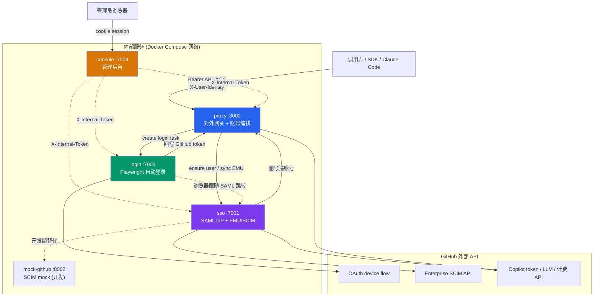
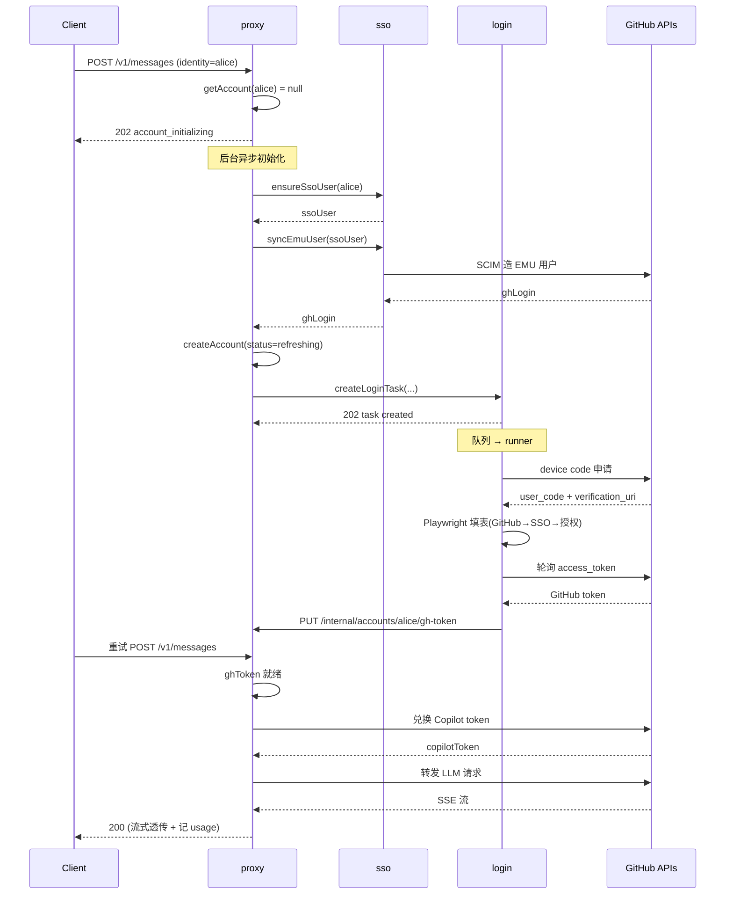

# GHCP API Learning — 项目地图

## 1. 项目概览

**核心目标**：把 GitHub Copilot 的后端能力包装成一套**集中化、多租户的“裸 API”服务**，对外暴露 OpenAI / Anthropic / Responses 兼容接口，对内自动管理一整条账号供应链：GitHub EMU 账号创建 → SSO 登录 → GitHub token → Copilot token。

**解决的真实痛点**：社区现有方案（LiteLLM、copilot2api 等）都是“单人本地代理一个登录态”。当要给**大量最终用户**合规提供服务时，需要“一个最终用户 ≈ 一个 GitHub 账号”，于是必须批量造号、批量登录、批量维护 token——这正是本项目的差异点。

**面向的调用方**：
- 内部应用 / SDK / Claude Code 客户端（走 proxy 的公共 API）
- 运维管理员（走 console 后台）

**运行方式**：**多服务 Proxy 架构**（不是单体）。5 个独立 Node.js 服务，通过 Docker Compose 编排，彼此用内部 HTTP API + 共享密钥通信。

> ⚠️ 项目自带免责声明：Copilot 没有官方裸 API，本项目依赖其**内部接口**，定位是学习/自维护，不适合无评估的生产。

---

## 2. 技术栈

| 维度 | 选型 |
| --- | --- |
| **语言** | TypeScript（ES2022 / NodeNext ESM，`strict`），Node.js 22 |
| **后端框架** | Express 5 |
| **前端框架** | React 19 + Vite 7 + Tailwind CSS 4（仅 console） |
| **包管理 / 构建** | npm **workspaces**（monorepo），`tsc` 编译后端，Vite 打包前端，`tsx` 跑开发态 |
| **数据存储** | better-sqlite3（proxy/sso/login 各一个独立 SQLite）；console 用 JSON 文件；mock-github 用内存 Map |
| **浏览器自动化** | Playwright + playwright-extra + puppeteer-extra-plugin-stealth（仅 login） |
| **SAML** | samlify + @authenio/samlify-node-xmllint（仅 sso） |
| **会话** | cookie-session（sso / console） |
| **测试框架** | **无统一测试套件**。质量门禁是 `typecheck`（详见第 9 节风险） |
| **部署** | Docker（每服务一个 Dockerfile）+ docker-compose |

---

## 3. 目录结构说明

```
ghcp-api-learning/
├── package.json            # monorepo 根：workspaces 定义 + 所有 start/build 脚本
├── docker-compose.yml      # 5 服务编排：端口、环境变量、健康检查、依赖顺序
├── tsconfig.base.json      # 所有服务共享的 TS 编译基线
├── .env / .env.example     # compose 顶层环境变量（密钥、header 配置）
├── scripts/                # gen-certs.sh(SAML证书) / validate-health.sh
├── certs/                  # 开发用 SAML IdP 证书（idp-cert.pem / idp-key.pem）
│
├── src/
│   ├── packages/shared/    # ★ 跨服务"契约层"——所有服务都依赖它
│   │   └── src/
│   │       ├── contracts.ts   # 所有 DTO + 枚举（单一事实来源）
│   │       ├── api.ts         # ApiError、X-Internal-Token 头、分页、批处理结构
│   │       ├── httpClient.ts  # JsonHttpClient（服务间调用统一客户端）
│   │       └── logger/redact/ids/time.ts  # 结构化日志、脱敏、ID、时间工具
│   │
│   ├── proxy/              # ★ 对外 API 网关 + 账号编排中枢（端口 3000）
│   │   └── src/
│   │       ├── server.ts          # Express 装配：/api /internal + 兼容路由
│   │       ├── routes/
│   │       │   ├── compatible.ts          # 公共 LLM 接口 + SSE 流式转发 + usage 统计
│   │       │   ├── claudeCodeCompat.ts    # Anthropic Messages 请求体改写（核心兼容层）
│   │       │   ├── anthropicModelProfiles.ts # 各 Claude 模型的 thinking/effort 能力画像
│   │       │   ├── adminApi.ts            # /api/* 管理接口（账号、统计、手动刷 token）
│   │       │   └── internalApi.ts         # /internal/* 服务间回调（login 回写 token）
│   │       ├── copilot/
│   │       │   ├── tokenManager.ts        # ★ 账号状态机（初始化 + token 刷新协调）
│   │       │   ├── copilotToken.ts        # GitHub token → Copilot token 兑换
│   │       │   └── copilotClient.ts       # 转发请求 + 模型列表缓存 + 路径能力推断
│   │       ├── accounts/githubTokenImport.ts # CSV 批量导入 GitHub token
│   │       ├── clients/{ssoClient,loginClient}.ts # 调 sso / login 的出站客户端
│   │       ├── auth/                      # apiKey / identityHeader / internalAuth 三道中间件
│   │       └── db/                        # proxy_accounts + proxy_request_stats
│   │
│   ├── sso/               # ★ 自建 SAML IdP + EMU/SCIM 同步 + Copilot 计费（端口 7001）
│   │   └── src/
│   │       ├── server.ts
│   │       ├── routes/{usersApi,samlRoutes,budgetApi}.ts
│   │       ├── saml/saml.ts        # IdP metadata、解析 AuthnRequest、签发 SAMLResponse
│   │       ├── scim/               # 调 GitHub SCIM 批量造号/暂停/删号（含重试限流）
│   │       ├── copilot/seats.ts    # 分配/回收 Copilot seat
│   │       ├── budget/             # AI Credits 用量查询 + 预测缓存
│   │       ├── users/              # SSO 用户 CRUD、批处理、EMU 反向导入计划
│   │       └── db/                 # sso_users + budget_cache + emu_import_plans + 事件日志
│   │
│   ├── login/            # ★ GitHub device flow + Playwright 自动登录（端口 7003）
│   │   └── src/
│   │       ├── server.ts
│   │       ├── routes/tasksApi.ts          # 登录任务 CRUD
│   │       ├── tasks/{queue,runner,accountLogger}.ts # 内存队列 + 任务执行 + 按账号日志
│   │       ├── auth/
│   │       │   ├── deviceFlow.ts                    # GitHub OAuth device code 申请+轮询
│   │       │   └── HeadlessPlaywrightAuthStrategy.ts # ★ 浏览器自动填表登录（690行，最脆弱）
│   │       ├── clients/proxyClient.ts      # 成功/失败回写 proxy
│   │       └── db/                         # login_tasks
│   │
│   ├── console/          # ★ React 管理后台 + API 转发中继（端口 7004）
│   │   └── src/
│   │       ├── server/      # Express：管理员鉴权 + 静态托管 + apiProxy(注入内部 token)
│   │       └── web/         # React SPA：7 个管理页 + 前端 API client
│   │
│   └── mock-github/      # 本地 SCIM mock（端口 8002，纯内存，开发期用）
│
├── docs/ copilot-api-tool/ emu-self-sso/ gh-auto-login/   # （按 AGENTS.md 约定已忽略）
```

---

## 4. 启动入口

**Monorepo 编排入口**：根 `package.json` 的 scripts —— `compose:up` / `start:*` / `build:deploy`。

**各服务运行链**（以 proxy 为例，其余同构）：
```
src/proxy/src/index.ts  →  startServer()  →  src/proxy/src/server.ts
   ├─ getDb()              # 打开 SQLite + 跑 migrations
   ├─ pruneAllRequestStats()
   └─ buildApp().listen(3000)
```

| 服务 | 入口文件 | 端口 | 容器启动命令 |
| --- | --- | ---: | --- |
| proxy | `src/proxy/src/index.ts` | 3000 | `npm run start:prod`（Dockerfile CMD） |
| sso | `src/sso/src/index.ts` | 7001 | 同构 |
| login | `src/login/src/index.ts` | 7003 | 同构（额外 `recoverInterruptedTasks()`） |
| console | `src/console/src/server/index.ts` | 7004 | 启动前需先 `vite build` 出 `dist/web` |
| mock-github | `src/mock-github/src/server.ts` | 8002 | 仅开发 |

**关键初始化流程**：
- **proxy 启动**不预建账号——账号是**懒初始化**的（首个未知 identity 请求触发，见第 6 节状态机）。
- **login 启动**会把上次中断的 pending/running 任务标记为 failed（防止重启后僵尸任务）。
- **compose 依赖顺序**：proxy 等 sso+login healthy；console 等三者都 healthy（`depends_on: condition: service_healthy`）。

---

## 5. 核心模块

### 5.1 proxy（对外网关 + 账号编排中枢）
- **职责**：API Key 鉴权、identity 解析、账号懒初始化、GitHub/Copilot token 生命周期、请求转发与 usage 统计。
- **关键文件**：`tokenManager.ts`（状态机）、`compatible.ts`（转发+流式）、`claudeCodeCompat.ts`（请求改写）、`copilotClient.ts`（模型缓存）。
- **对外接口**：`GET /v1/models`、`POST /chat/completions`、`POST /responses`、`POST /v1/messages`、`POST /v1/messages/count_tokens`；管理面 `/api/accounts*`、`/api/request-stats`；服务间 `/internal/accounts/*`。
- **依赖**：sso（ensure user / sync EMU）、login（建登录任务）、GitHub Copilot APIs。
- **被调用**：console（管理）、login（回写 token）、sso（删号时清账号）。

### 5.2 sso（SAML IdP + EMU/SCIM + 计费）
- **职责**：自建 SAML IdP；SSO 用户库；通过 GitHub SCIM 批量造号/暂停/删号；Copilot seat 分配；AI Credits 用量。
- **关键文件**：`saml/saml.ts`、`scim/scimClient.ts`（含指数退避重试 + 全局串行限流）、`users/service.ts`（批处理调度）。
- **对外接口**：SAML 公开路由 `/metadata /sso /login /logout`；内部 `/api/users/*`（ensure/批处理/导入）、`/api/ai-credits/usage*`。
- **依赖**：GitHub SCIM API、GitHub Copilot 计费 API、proxy（删号回调）。
- **被调用**：proxy（初始化账号）、console（用户管理）、GitHub（SAML 登录跳转）。

### 5.3 login（自动登录）
- **职责**：执行 GitHub OAuth device flow + Playwright 无头浏览器完成 SSO 登录，拿到 GitHub token 回写 proxy。
- **关键文件**：`deviceFlow.ts`、`HeadlessPlaywrightAuthStrategy.ts`（最脆弱，强依赖页面选择器）、`tasks/queue.ts`（并发受控的内存队列）。
- **对外接口**：`/api/tasks`（建/查/取消/重试/删）。
- **依赖**：GitHub device 端点、目标 SSO 页面（custom / azure）、proxy（回写 token 或标记失败）。
- **被调用**：proxy（初始化 / 手动刷 GitHub token）、console（任务管理）。

### 5.4 console（管理后台）
- **职责**：浏览器只访问 `/api/console/**`，服务端注入 `X-Internal-Token` 后**转发**给 proxy/sso/login；自己只存管理员账号。
- **关键文件**：`server/apiProxy.ts`（转发中继）、`server/adminsStore.ts`（scrypt 哈希的 admins.json）、`web/App.tsx`（7 页）。
- **7 个管理页**：Dashboard / SSO Users / AI Credits / Request Stats / Proxy Accounts / Login Tasks / Diagnostics。

### 5.5 packages/shared（契约层）
- **职责**：所有 DTO、枚举、ApiError 结构、分页/批处理形状、`JsonHttpClient`、logger/redact 的**单一事实来源**。改 API 必从这里改。
- **被调用**：所有 5 个服务。

---

## 6. 关键执行链路

### 链路 A：首次调用某 identity（账号懒初始化）— 本项目最核心的流程

```
Client POST /v1/messages (Bearer API_KEY + X-User-Identity: alice)
  → proxy: requireApiKey → requireIdentityHeader → compatibleRouter
  → tokenManager.getToken("alice")
  → getAccount() 返回 null  →  抛 TokenNotReadyError(202, account_initializing)
                            ↘ 后台异步 initializeIdentityOnce():
                                 1. ssoClient.ensureSsoUser()  → sso 建/取 SSO 用户
                                 2. ssoClient.syncEmuUser()     → sso 调 SCIM 造 EMU 号，拿 ghLogin
                                 3. createAccount(status=refreshing)
                                 4. loginClient.createLoginTask() → login 建登录任务
  ← 202 account_initializing（客户端需稍后重试）

  [login 侧异步] queue → runner → deviceFlow.requestDeviceCode()
                              → Playwright 自动填表(GitHub登录→SSO→输device code→授权)
                              → deviceFlow.pollAccessToken() 拿到 GitHub token
                              → proxyClient PUT /internal/accounts/alice/gh-token  (回写)

Client 重试 POST /v1/messages
  → tokenManager.getToken("alice")
  → account.ghToken 已就绪，但无有效 copilotToken → refreshCopilot()
  → exchangeCopilotToken(ghToken)  →  GitHub copilot_internal/v2/token
  → 缓存 copilotToken
  → forwardWithRetry → assertModelSupportsPath → forwardCopilotRequest → Copilot API
  → pipeAndRecord：流式透传 SSE + 解析 usage + recordRequestStat
  ← 200 (text/event-stream)
```

### 链路 B：Claude Code 优化转发（`CLAUDE_CODE_OPTIMIZED=true` 时）
```
POST /v1/messages
  → prepareClaudeCodeMessagesRequest():
       归一化模型名 → 按 model profile 调整 thinking/effort/budget
       → 剥离不支持的 beta / cache_control.scope / 易变 currentDate
       → 清理非法 thinking 块、合并 tool_result、改写中途 system 消息
       → 推断 anthropic-version / anthropic-beta / x-initiator header
  → 401 自动用 refreshCopilot 重试一次
  → web_search 工具不被 Copilot 支持时翻译成友好错误
```

### 链路 C：管理后台转发
```
Admin Browser → console /api/console/sso/users
  → requireAdmin（cookie session）
  → apiProxy 注入 X-Internal-Token，转发 → sso http://sso:7001/api/users
  ← 透传响应
```

---

## 7. 架构图

### 7.1 系统整体架构



> 注意：`login` 与 `sso` **没有直接服务间 API 调用**——都由 proxy 分别协调；login 只在浏览器自动化时“跟随”GitHub 的 SAML 跳转访问 sso 登录页。

### 7.2 关键调用链时序图（账号初始化 + 首次成功调用）



---

## 8. 阅读建议

如果第一次看这个项目，推荐顺序：

1. **先看 `README.md` + `src/README.md`** — 它们把“为什么需要 EMU+SSO+自动登录”这条业务动机讲透了，是理解整个架构存在意义的前提。

2. **再看 `src/packages/shared/src/contracts.ts`** — 这是所有服务的“数据词典”。先认识 `ProxyAccountDto`、`SsoUserDto`、`LoginTaskDto` 和那几个枚举（`GhTokenStatus`/`EmuStatus`/`LoginTaskStatus`），后面看任何服务都不会迷路。

3. **再看 `src/proxy/src/copilot/tokenManager.ts`** — 这是整个系统的**大脑/状态机**。`getToken()` 的几个分支（无账号→初始化、token refreshing、copilot 过期→刷新）串起了 proxy→sso→login 的全部协作。

4. **再看 `src/proxy/src/routes/compatible.ts`** — 理解请求怎么转发、SSE 怎么流式透传、usage 怎么统计、401 怎么重试。

5. **再看 `src/login/src/tasks/runner.ts` + `auth/deviceFlow.ts`** — 理解“造好号之后怎么真正登进去拿 token”，这是项目最 hacky 也最有价值的部分。`HeadlessPlaywrightAuthStrategy.ts` 可略读（690 行选择器逻辑，需要时再深入）。

6. **再看 `src/sso/src/users/service.ts` + `scim/scimClient.ts`** — 理解批量造号、EMU 状态、删号级联。

7. **最后看 `src/proxy/src/routes/claudeCodeCompat.ts`** — 这是最细节、最易变的兼容层（请求体魔改）。只有在做 Claude Code 适配时才需要精读。`console` 前端可以最后按需看。

---

## 9. 风险和注意点

**🔴 安全 / 敏感数据**
- **token / 密码明文落库**：`proxy_accounts` 明文存 `gh_token`、`copilot_token`；SQLite 文件本身就是密钥仓库，绝不能提交或泄露。
- **内部信任全靠一个共享密钥**：`INTERNAL_API_TOKEN`（`X-Internal-Token`）是 console↔proxy↔sso↔login 之间唯一的鉴权，明文逐请求传递，无 HMAC/签名。泄露 = 全线沦陷。四个服务必须配成同一值。
- **EMU/SSO 默认弱密码**：`tokenManager` 初始化时 `ssoPassword = ensured.passwordForLogin ?? ssoUser`；sso 的 CSV/EMU 导入也默认把密码设为 ssoUser。可预测的 identity → 可预测的密码。
- **console 管理员存 JSON 文件**：scrypt 哈希但无加密，安全性依赖文件系统权限。

**🟠 隐藏耦合 / 易误解**
- **login 与 sso 看似独立实则隐性耦合**：没有 API 调用关系，但 login 的 Playwright 脚本**硬依赖 sso 登录页的 DOM 结构**。改 sso 登录页可能静默打断 login 自动化。
- **三处状态必须一致**：一个账号的真实状态分散在 `sso_users`、`login_tasks`、`proxy_accounts` 三个库。排查“账号卡住”必须三处对照（src/README 第 8 节也强调了）。
- **删号级联不是事务**：sso 删用户 → 删 SCIM → 调 proxy 清账号。任一步失败会留下孤儿数据（如 proxy 账号已删但 SCIM 还在，或反之）。
- **模型→API 路径靠启发式推断**：`copilotClient.ts` 的 `inferSupportedPaths()` 用模型名正则（claude→/v1/messages，gpt-5/codex/o\d→/responses…）猜路径。Copilot 上线新模型命名不符合正则时会误判。proxy **不做**三种 API 形状之间的互转，调用方必须把请求发到匹配路径。

**🟡 脆弱 / 易变逻辑**
- **`HeadlessPlaywrightAuthStrategy.ts` 是最大的脆弱点**：690 行全是页面选择器 + fallback。GitHub 或 SSO 改 UI 就会断。已设计 `selectorOverrides` 运行时覆盖来缓解——改登录流程优先调选择器/debug 配置，确认是流程变化再动这个文件。
- **`claudeCodeCompat.ts` 请求体魔改**：约 20 个清洗函数（剥 beta、改 thinking budget、重写 system 消息位置、合并 tool_result…）。每个都是为绕过 Copilot 后端的具体限制而写，改动前要理解每条规则对应的后端约束，否则会破坏 Claude Code 兼容。
- **`anthropicModelProfiles.ts` 是硬编码模型清单**：新 Claude 模型发布需手工加 profile；未命中走正则兜底，可能给错 thinking/effort 策略。

**⚪ 工程化缺口**
- **无测试套件**：唯一的质量门禁是 `typecheck`。任何逻辑改动都没有自动化测试网，回归风险高。改动后至少跑受影响 workspace 的 typecheck。
- **登录任务队列是纯内存**：`login` 的 queue 在进程内存，重启丢失（已用 `recoverInterruptedTasks` 把中断任务标 failed 兜底，但需重新触发）。
- **mock-github 未经测试**：src/README 明确标注“只在项目初期用过，未做测试”。
- **SCIM 全局串行限流**：`scimClient` 用单个 `nextScimRequestAt` 变量串行化所有 SCIM 请求，大批量操作会被这个瓶颈拖慢。
