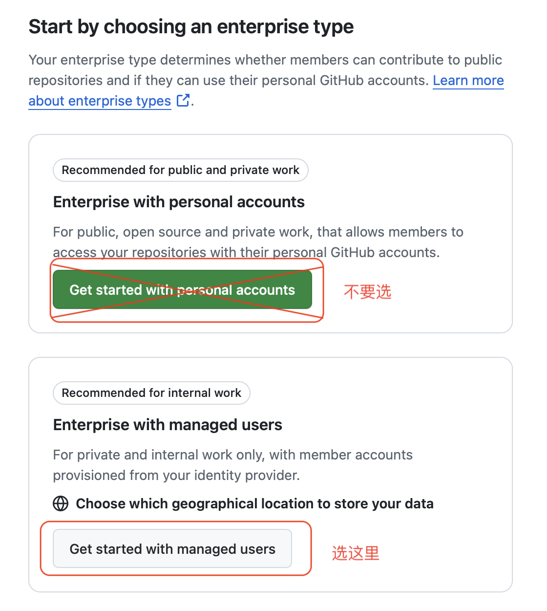
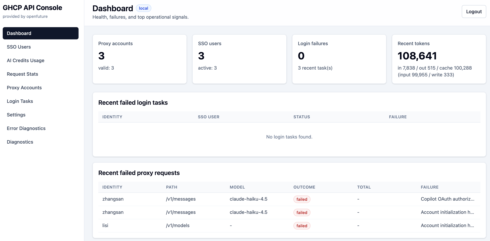
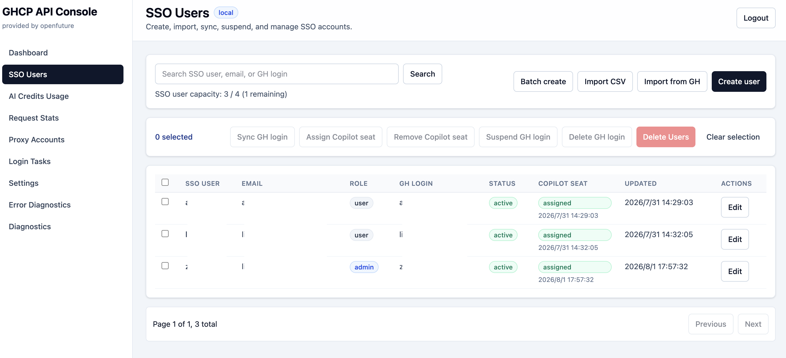
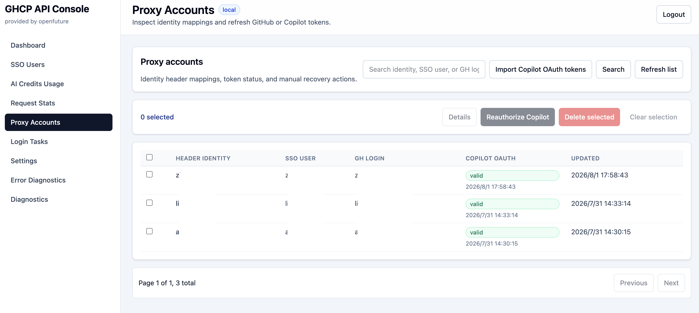
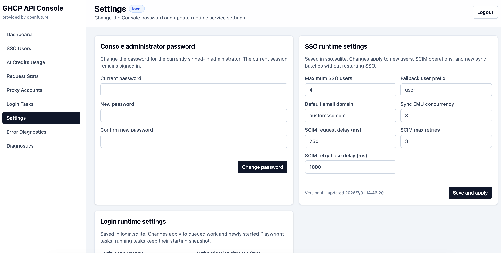
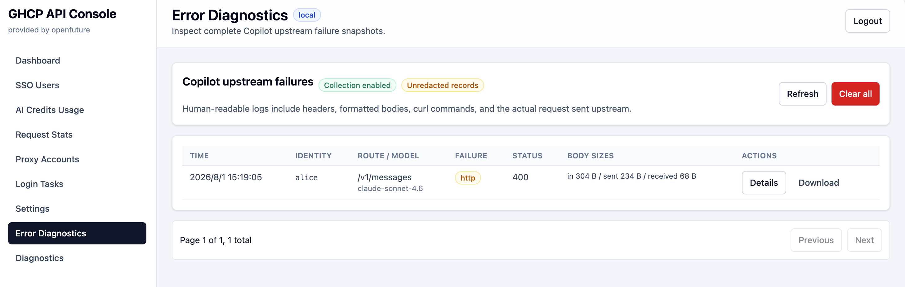

# GitHub Enterprise EMU 与 GHCP API Console 配置手册

本文面向第一次接触 GitHub Enterprise 管理、Enterprise Managed Users(EMU)、SAML SSO、SCIM、GitHub Copilot seat 和本项目部署配置的读者。目标是帮助你从零完成 GitHub Enterprise EMU 初始化、本项目 SSO/Console/Proxy/Login 服务配置、Copilot 授权管理，以及最终用户侧 API 调用验证。

> **重要**：GitHub Copilot 当前不提供面向第三方服务端集成的正式公开裸 API。本项目依赖 GitHub Copilot 内部接口，适合学习、验证和自维护部署。用于生产前，需要**自行评估**合规、稳定性、安全、账号管理、日志留存和运维风险。

## 1. 你最终会配置出什么

完成本文步骤后，系统会形成如下链路：

```text
Client / SDK / Internal App
  -> proxy compatible API
  -> proxy 按 X-User-Identity 找到或初始化账号
  -> sso 创建本地 SSO 用户并通过 SCIM 同步到 GitHub Enterprise EMU
  -> login 通过 Playwright 完成 GitHub device flow + SSO 登录
  -> login 把 Copilot OAuth token 回写给 proxy
  -> proxy 直接使用该 OAuth token 转发请求到 GitHub Copilot 后端
```

后台管理入口是 `console`。管理员通过 `console` 管理 SSO 用户、EMU 同步、Copilot seat、AI Credits、Proxy 账号、Login 任务和请求统计。

| 模块 | 默认端口 | 作用 |
| --- | ---: | --- |
| `proxy` | `3000` | 对外提供 OpenAI / Anthropic / Responses 兼容 API；负责 API key、identity、Copilot OAuth token、请求转发和统计。 |
| `sso` | `7001` | 自定义 SAML IdP；管理本地 SSO 用户、SCIM/EMU、Copilot seat 和 AI Credits。 |
| `login` | `7003` | 通过 GitHub Device Flow 和 Playwright 完成 SSO 授权，并把 Copilot OAuth token 回写给 `proxy`。 |
| `console` | `7004` | Web 管理控制台；统一操作 `proxy`、`sso`、`login` 的内部 API。 |

## 2. 关键概念

> 请在部署前务必了解项目的设计思路。

### 2.1 GitHub Enterprise EMU

GitHub Enterprise Managed Users(EMU) 是由企业统一管理的 GitHub 用户体系。EMU 用户不是普通个人 GitHub 账号，而是由企业身份系统通过 SAML SSO 登录、通过 SCIM 创建和管理。

创建 EMU 时会遇到两个重要字段：

| 字段 | 说明 |
| --- | --- |
| Enterprise slug | Enterprise 的 URL 标识。例如 slug 为 `acme` 时，Enterprise URL 中会出现 `/enterprises/acme`。 |
| shortcode | EMU 登录名后缀。例如 shortcode 为 `open`，本地 SSO 用户 `alice` 在 GitHub 侧登录名通常是 `alice_open`。 |

创建完成后，GitHub 会先生成一个初始超级管理员，格式通常是 `admin_<shortcode>`。后续建议通过本项目创建并同步一个新的管理员 EMU 用户，用它承担日常管理工作。

### 2.2 SAML SSO 与 SCIM

SAML SSO 解决“用户如何登录 GitHub Enterprise”的问题；SCIM 解决“用户如何被创建、更新、暂停、删除到 GitHub Enterprise”的问题。

在本文方案中：

- `sso` 服务扮演自定义 SAML IdP。
- GitHub Enterprise 作为 SAML SP。
- `sso` 服务使用 GitHub SCIM API 把本地用户同步为 EMU。
- SAML 配置中的 Sign on URL 指向 `https://<sso-public-base-url>/sso`。
- SAML 配置中的 Issuer 指向 `https://<sso-public-base-url>/metadata`。
- Public certificate 来自 `certs/idp-cert.pem`。

### 2.3 PAT、Copilot seat 与 AI Credits

本项目需要一个 GitHub 管理 PAT 写入 `GITHUB_COPILOT_SEAT_PAT`。它用于：

- 调用 `POST/DELETE /enterprises/{enterprise}/copilot/billing/selected_users` 分配或移除 Copilot seat。
- 调用 `/enterprises/{enterprise}/settings/billing/usage/summary?sku=copilot_ai_unit` 查询 AI Credits 用量。

创建 PAT 时，请使用已经同步到 GitHub Enterprise 且具备企业管理权限的 EMU 管理员账号。GitHub 权限页面可能随产品变化而调整，原则是该 PAT 必须能管理 Enterprise Copilot seat，并能读取 Enterprise billing usage。

### 2.4 三类 Token/Key 不要混淆

| 凭据 | 归属与用途 | 是否按最终用户区分 |
| --- | --- | --- |
| `API_KEY` | 本项目 Proxy 公共接口的本地访问 key。 | 当前部署共享；真正的用户归属由 identity header 决定。 |
| `GITHUB_COPILOT_SEAT_PAT` | SSO 服务使用的企业管理 PAT，只用于 Copilot seat 管理和 AI Credits 查询。 | 否，由企业管理员维护。 |
| Copilot OAuth token | Login 使用 OpenCode OAuth client 完成 GitHub Device Flow 后获得，回写并保存在 `proxy.sqlite`；Proxy 直接用它访问 Copilot API。 | 是，每个 Proxy identity 单独保存。 |

当前代码不保存独立的 GitHub token，也不存在“Proxy 用 GitHub token 再换取短期 Copilot token”的步骤。`GITHUB_COPILOT_SEAT_PAT` 是管理员用于同步 SSO 用户到 GitHub 上使用的，与最终用户的 Copilot OAuth 授权是两条独立链路。

## 3. 准备工作清单

开始前请确认你具备以下条件：

| 类别 | 需要准备的内容 |
| --- | --- |
| GitHub 权限 | 可创建 GitHub Enterprise；可进入 Enterprise settings；可配置 SAML SSO、SCIM、Billing、Copilot。 |
| 管理邮箱 | 用于接收初始超级管理员密码重置邮件，必须是真实可访问邮箱。 |
| Copilot 开通 | Enterprise 需要能开通 GitHub Copilot；必要时可提交 GitHub Support 工单。 |
| Billing | 可填写 GitHub Enterprise billing 信息，并可关联 Azure Subscription 或其他账单方式。 |
| 网络 | `sso` 服务需要有 GitHub 可访问的公网地址。 |
| 证书 | 准备 SAML IdP 证书和私钥；开发验证可用 `scripts/gen-certs.sh` 生成。 |
| 运行环境 | Docker / Docker Compose；本地开发还需要 Node.js 22 和 npm。 |

### 3.1 初始化关键资料与使用边界

Enterprise、Billing、管理员身份和 EMU 用户资料会影响企业验证、账单、审计、账号恢复与 Copilot 授权。初始化时应直接填写真实、长期有效的信息，不要先用临时占位内容创建后再等待修正。

| 项目 | 初始化要求 | 不应使用 |
| --- | --- | --- |
| 企业与 Billing 信息 | 最好使用实际法定主体的公司名称、billing/shipping address、国家或地区、税务及付款联系人；各项中的公司名称和地址应保持一致。 | 虚构公司名、临时地址、与付款主体不一致的信息。 |
| Enterprise 管理员邮箱 | 使用企业自有域名下、可长期访问和审计的公司邮箱，并确认能够接收密码重置、安全通知和账单邮件。 | `gmail.com`、`outlook.com` 等免费公共邮箱，或非真实邮箱。 |
| EMU 用户资料 | 请按真实员工身份创建账号，使用可追溯到个人的id、企业用户名和企业邮箱；离职或调岗时按企业身份流程暂停或回收。 | `user01`、`user02` 等无真实身份含义的批量占位账号，或多人共用的账号。 |
| Entra tenant | 如果使用 EMU 的IdP是 Microsoft Entra tenant，请尽量使用企业自有域名，并由具备订阅管理权限的企业管理员完成授权。 | 免费/试用 tenant，或把默认 `*.onmicrosoft.com` 域名作为生产 EMU 用户域名。 |
| Copilot 账号与 seat | 每个实际用户使用自己的 EMU 身份和 Copilot seat，保持身份、使用记录和授权一一对应。 | 为减少 seat 数量而共享账号、token、登录态或 Copilot 访问权限。 |

> 本项目的 proxy 依赖 GitHub Copilot 内部接口，不属于 GitHub 官方支持的通用 LLM gateway 集成。它适合学习和验证；生产环境应优先采用 GitHub 官方支持的客户端/API，并在部署前完成许可、合规和安全评估。

建议先准备一个配置表，记录但不要公开以下值：

| 配置 | 示例 | 说明 |
| --- | --- | --- |
| `ENTERPRISE_SLUG` | `acme` | GitHub Enterprise slug。不是贴enterprise的地址，是一个字符串。 |
| `ENTERPRISE_SHORTCODE` | `open` | EMU 登录名后缀。 |
| `SSO_PUBLIC_BASE_URL` | `https://sso.example.com` | GitHub 可访问的 SSO 公网地址。 |
| `SCIM_BASE_URL` | `https://api.github.com/scim/v2/enterprises/acme` | GitHub Enterprise SCIM API 地址。 |
| `SP_ENTITY_ID` | `https://github.com/enterprises/acme` | GitHub Enterprise SAML SP entity ID。 |
| `SP_ACS_URL` | `https://github.com/enterprises/acme/saml/consume` | GitHub Enterprise SAML ACS 地址。 |
| `API_KEY` | 自定义强随机值 | 调用 proxy 公共 API 的 Bearer token。 |
| `INTERNAL_API_TOKEN` | 自定义强随机值 | `proxy`、`sso`、`login`、`console` 内部通信共享密钥。 |
| `SESSION_SECRET` | 自定义强随机值 | `sso` 和 `console` cookie session 签名密钥。 |

## 4. 创建 GitHub Enterprise EMU

### 4.1 从个人 GitHub 账号创建 Enterprise

登录 GitHub 后，从个人 profile 菜单进入 Enterprise 创建入口。此处使用的是个人 GitHub 账号完成 Enterprise 创建动作；完成 EMU 初始化后，日常管理会切换到 EMU 管理员账号。


操作要点：

1. 打开右上角个人 profile 菜单。
2. 找到 Enterprise 相关入口。
3. 开始创建新的 Enterprise。

### 4.2 选择 Enterprise Managed Users

Enterprise 类型选择 **Enterprise with managed users**。Identity Provider 选择 **Custom or Other**，表示后续由本项目的 `sso` 服务作为自定义 SAML IdP。



不要选择普通 Enterprise users 模式，否则后续无法按本文方式通过 SCIM 批量管理 EMU 用户。

### 4.3 填写 EMU 信息

填写 Enterprise slug、shortcode 和管理员邮箱。管理员邮箱必须真实可用，因为 GitHub 会把初始超级管理员的密码重置链接发送到该邮箱。


填写时请特别注意：

- slug 创建后会用于 Enterprise URL，也会出现在 `ENTERPRISE_SLUG`、`SCIM_BASE_URL`、`SP_ENTITY_ID`、`SP_ACS_URL` 中。
- shortcode 会影响所有 EMU 用户的 GitHub 登录名。例如本地 SSO 用户 `alice` 可能需要用 `alice_<shortcode>` 登录 GitHub。
- 初始超级管理员通常是 `admin_<shortcode>`。
- 管理员邮箱务必使用企业自有域名的公司邮箱，不要使用 Gmail、Outlook 等免费公共邮箱；同时确认该邮箱有明确的长期负责人和恢复流程。

### 4.4 通过邮件设置初始超级管理员密码

创建成功后，打开管理员邮箱中的 GitHub 邮件，使用其中的密码重置链接设置初始超级管理员密码。


设置密码后，使用 `admin_<shortcode>` 登录 GitHub Enterprise 管理页面。


此时个人 GitHub 账号不再直接承担该 EMU Enterprise 的日常管理员身份。后续会通过本项目创建一个新的 SSO 管理员用户，并同步成 GitHub Enterprise 管理员。

## 5. 生成 SCIM token

进入 GitHub Enterprise settings 中的 SAML/SCIM 或 provisioning 相关页面，生成 SCIM token。


生成后立即复制并保存。SCIM token 后续写入根目录 `.env`：

```env
SCIM_BASE_URL=https://api.github.com/scim/v2/enterprises/<enterprise-slug>
SCIM_TOKEN=<your-scim-token>
```

注意事项：

- token 通常只展示一次。
- 不要把 token 放进截图、聊天记录、issue、commit 或日志。
- 如果 token 泄露，应立即在 GitHub Enterprise 中吊销并重新生成。

## 6. 配置并启动本项目基础服务

### 6.1 准备 `.env`

在仓库根目录执行：

```bash
cp .env.example .env
```

根 `.env` 用于 Docker Compose 变量插值；只有 `docker-compose.yml` 明确列出的变量才会传入容器。`src/<service>/.env` 只用于单独运行对应 workspace，不会被 Compose 自动加载。环境变量都在服务启动时读取，修改后需要重启对应服务。

至少需要替换以下值：

| 变量 | 说明 |
| --- | --- |
| `API_KEY` | 调用 `proxy` 公共 API 使用。调用方用 `Authorization: Bearer <API_KEY>` 或 `x-api-key: <API_KEY>`。 |
| `INTERNAL_API_TOKEN` | 内部 API 共享密钥。`proxy`、`sso`、`login`、`console` 必须一致。 |
| `SESSION_SECRET` | `sso` / `console` cookie session 签名密钥。生产环境必须使用强随机值。 |
| `SSO_PUBLIC_BASE_URL` | `sso` 服务对 GitHub 可访问的公网地址。 |
| `SP_ENTITY_ID` | `https://github.com/enterprises/<enterprise-slug>`。 |
| `SP_ACS_URL` | `https://github.com/enterprises/<enterprise-slug>/saml/consume`。 |
| `ENTERPRISE_SLUG` | 创建 EMU 时填写的 slug。 |
| `ENTERPRISE_SHORTCODE` | 创建 EMU 时填写的 shortcode。 |
| `SCIM_BASE_URL` | `https://api.github.com/scim/v2/enterprises/<enterprise-slug>`。 |
| `SCIM_TOKEN` | 第 5 节生成的 SCIM token。 |
| `GITHUB_COPILOT_SEAT_PAT` | 第 9 节创建的 GitHub 管理 PAT；此时还没有可以先留空，创建后再补。 |
| `LOGIN_SSO_URL` | Login 容器内 Playwright 能访问的完整 SSO 登录页。Compose 内部通常使用 `http://sso:7001/login`；跨网络部署时使用从 Login 节点可访问的完整 `/login` URL。 |

如果使用 Docker Compose，默认端口来自 `.env`：

```env
PROXY_PORT=3000
SSO_PORT=7001
LOGIN_PORT=7003
CONSOLE_PORT=7004
```

这些端口变量只控制暴露到宿主机的端口；容器内端口固定为 `3000`、`7001`、`7003`、`7004`。服务间地址由 Compose 固定为 `proxy:3000`、`sso:7001`、`login:7003`，不要在容器间调用中使用宿主机 `localhost`。

#### Proxy 与 Login 行为配置

| 变量 | 模板值/默认值 | 作用 |
| --- | --- | --- |
| `IDENTITY_HEADER` | `X-User-Identity` | Proxy 用于区分最终用户的 header 名。 |
| `IDENTITY_HEADER_REQUIRED` | `true` | 建议保持 `true`；设为 `false` 且请求缺 header 时会使用共享的 `default` identity。 |
| `CLAUDE_CODE_OPTIMIZED` | Compose 默认 `true`；代码默认 `false` | Proxy 的 Claude Code/Anthropic Messages 默认兼容模式；单个请求可用 `X-Claude-Code-Optimized` 覆盖。 |
| `REQUEST_STATS_PER_ACCOUNT_LIMIT` | `2` | 每个 identity 保留的最近请求统计数，必须为正整数；代码、Compose fallback 和环境变量示例默认值一致。 |
| `PROXY_ERROR_DIAGNOSTICS_ENABLED` | `true` | 是否保存 Copilot 上游 HTTP、网络和响应流失败现场。 |
| `PROXY_ERROR_DIAGNOSTICS_DIR` | Compose 为 `/data/error-diagnostics` | 人类可读诊断日志目录；默认位于 `proxy-data` volume。 |
| `PROXY_ERROR_DIAGNOSTICS_REDACT` | `false` | 是否脱敏敏感 headers 和 JSON 字段；默认不脱敏。 |
| `PROXY_ERROR_DIAGNOSTICS_MAX_FILE_MB` | `50` | 单个轮转文件目标上限 MB。 |
| `PROXY_ERROR_DIAGNOSTICS_MAX_FILES` | `5` | 包含当前文件在内的最大文件数。 |
| `GITHUB_OAUTH_CLIENT_ID` | OpenCode client id | Login Device Flow 使用的 OAuth client id；除非明确更换兼容 client，否则保持模板值。 |
| `GITHUB_OAUTH_SCOPE` | `read:user` | Login Device Flow 请求的 scope。 |
| `COPILOT_API_BASE_URL` | `https://api.githubcopilot.com` | Proxy 直接访问 Copilot API 的 base URL。 |
| `OPENCODE_VERSION` | 根模板为 `1.18.4` | 生成 Proxy/Login 的 `User-Agent: opencode/<version>`；如显式注入 `OPENCODE_USER_AGENT`，后者优先。 |
| `GITHUB_API_VERSION` | `2026-06-01` | Proxy 发给 Copilot API 的 `X-GitHub-Api-Version`。 |
| `LOGIN_SSO_PROVIDER` | `custom` | 默认 SSO provider：`custom` 或 `azure`；任务参数可覆盖。 |
| `AUTH_HEADLESS` | `true` | Playwright 是否无头运行。建议使用无头浏览器。 |

#### SSO、GitHub API 与初始密码

| 变量 | 模板值/默认值 | 作用 |
| --- | --- | --- |
| `SSO_PUBLIC_BASE_URL` | 模板为 localhost | SSO 对 GitHub 可访问的稳定公网 base URL，例如 `https://sso.example.com`；不要附加 `/sso` 或 `/metadata`。 |
| `SSO_CERT_DIR` | `./certs` | 宿主机证书目录；Compose 只读挂载到 SSO 容器 `/certs`。 |
| `ENTERPRISE_SHORTCODE` | `octo` | 必须改成创建 EMU 时确定的 shortcode，不能无条件沿用示例值。 |
| `GITHUB_API_BASE_URL` | `https://api.github.com` | SSO 调用 Copilot seat、AI Credits 等 GitHub API 的根地址。 |
| `GITHUB_COPILOT_SEAT_PAT` | 默认空 | 为空时可先启动基础服务，但 seat 管理和 AI Credits 刷新不可用；写入后重启 SSO。 |
| `SSO_DEFAULT_USER_PASSWORD` | 空 | 新建 SSO 用户未显式提供密码时使用；为空会退回使用 `ssoUser` 作为密码，只适合受控验证环境。生产环境应设置强值，或为真实用户配置独立密码。修改该变量不会更新现有用户的密码 hash，轮换时必须同步修改用户密码。 |
| `LOG_LEVEL` | `info` | 所有服务的结构化日志等级：`debug`、`info`、`warn`、`error`。 |

`API_KEY`、`INTERNAL_API_TOKEN`、`SESSION_SECRET`、`SCIM_TOKEN`、PAT 和默认密码都属于敏感启动配置，不应放到 Console Settings、仓库、截图或普通日志中。错误诊断默认不脱敏，会有意保存这些请求现场；应通过 volume 权限、备份策略和 Console 管理员权限保护。

生产环境建议保持 `LOG_LEVEL=info`：这样能看到上游 4xx 的 `warn` 和 5xx/网络/流错误的 `error`。`debug` 只在短时间排障时启用；`LOG_LEVEL=error` 会隐藏上游 4xx，不建议常态使用。错误诊断落盘与 `LOG_LEVEL` 无关，即使使用 `info` 也会按 `PROXY_ERROR_DIAGNOSTICS_ENABLED` 保存完整现场。


### 6.2 生成 SAML 证书

开发验证可执行：

```bash
bash scripts/gen-certs.sh
```

默认会生成：

```text
certs/idp-cert.pem
certs/idp-key.pem
```

其中 `idp-cert.pem` 的内容会复制到 GitHub Enterprise SAML 配置页面的 **Public certificate** 字段；`idp-key.pem` 由 `sso` 服务用于签名 SAMLResponse。

生产环境建议使用你自己维护的正式证书和私钥，并通过 `SSO_CERT_DIR` 指向证书目录。

### 6.3 启动 SSO 与 Console

用 Docker Compose 启动完整服务（因为配置还未完成，所以完整服务会有部分功能不可用）：

```bash
npm run compose:up
```

或者在本地开发模式下单独启动服务（当前阶段只需要sso 和 console）：

```bash
npm install
npm run start:sso
npm --workspace @ghcp/console run build
npm run start:console
```

截图中的步骤展示了启动sso的配置文件：


启动后打开：

```text
http://localhost:7004
```

首次访问 Console 会进入 setup 页面，创建第一个本地管理员；当前角色固定为 `admin`。这个账号只用于登录本项目 Console，不是 GitHub Enterprise 管理员。

### 6.4 创建首个 SSO 管理员用户

在 console 的 SSO Users 页面创建第一个 SSO 用户，并将它设置为管理员角色。该用户同步到 GitHub Enterprise 后，会作为新的 GitHub Enterprise 管理员使用。


用户名和邮箱应对应真实管理员身份。文档中的 `alice` 等名称仅为示例；正式初始化不要使用 `admin01`、`user01`、`user02` 等占位账号，也不要建立供多人共享的管理员账号。

请记录：

- SSO 用户名。
- SSO 登录密码。
- 该用户的管理员角色。
- 对应 GitHub 登录名格式：`<ssoUser>_<enterprise-shortcode>`。

本项目中，SSO 本地用户角色为 `admin` 时，同步 EMU 时可映射为 GitHub Enterprise 的 `enterprise_owner`。

### 6.5 确认 Console Runtime Settings

Console 的 **Settings** 页面修改的是 SSO/Login SQLite 中的运行时设置，不是 `.env`。保存后无需重启当前服务实例；首次升级创建 settings 表时使用下表代码默认值，不会从旧环境变量导入。

| 服务 | Setting | 默认值 | 范围与作用 |
| --- | --- | ---: | --- |
| SSO | `maxSsoUsers` | 不限 | 空值或 `1..1000000`；限制 SSO 用户总数。降低上限不会删除现有用户。但是不建议设置超过2w。如果用户量很大，请务必提前联系 GitHub 销售提前说明。 |
| SSO | `userPrefix` | `user` | identity 无法生成用户名时的 fallback；不重命名现有用户。慎用，大量用户可能导致后台认为有欺诈行为。 |
| SSO | `emailDomain` | `customsso.com` | 新用户未显式提供邮箱时的默认企业域名。正式初始化应改成企业自有域名。 |
| SSO | `bulkSyncConcurrency` | `3` | `1..20`；只控制 `sync_emu` 批处理。 |
| SSO | `scimRequestDelayMs` | `250` | `0..60000`；同一 SSO 进程的 SCIM 请求最小间隔。 |
| SSO | `scimMaxRetries` | `3` | `0..10`；SCIM 最大重试次数。 |
| SSO | `scimRetryBaseDelayMs` | `1000` | `0..60000`；SCIM 指数退避基础延迟。 |
| Login | `concurrency` | `1` | `1..20`；当前 Login 进程同时运行的任务数。调低不会中断运行中任务。 |
| Login | `authTimeoutMs` | `60000` | `5000..600000`；新启动登录任务的认证超时。 |
| Login | `authDebugLogs` | `false` | 新启动任务是否写详细账号日志。 |
| Login | `authDebugArtifacts` | `false` | 新启动任务是否保存截图、trace 等调试产物。 |

建议初始化时至少确认：

1. `emailDomain` 已改成企业自有域名。
2. `maxSsoUsers` 符合实际许可和运营规模。
3. SCIM delay/retry 保持保守默认值，确认稳定后再调整。
4. Login 并发先保持 `1`；只有确认浏览器资源和出口网络稳定后再提高。
5. Debug artifacts 只在排障期间开启，处理完成后关闭并清理敏感产物。

Settings 更新带版本号并使用乐观锁；另一管理员已先保存时 Console 会提示冲突并重新加载。当前 settings cache 是进程内的，多实例部署不会自动同步缓存，扩容前需要额外设计跨实例失效机制。

## 7. 配置 GitHub Enterprise SAML SSO

### 7.1 打开 SAML SSO 配置

回到 GitHub Enterprise settings，进入 SAML SSO 配置页面。


### 7.2 填写 SAML 配置

在 single sign-on configuration 页面填写：

| GitHub 字段 | 填写值 |
| --- | --- |
| Sign on URL | `https://<sso-public-base-url>/sso` |
| Issuer | `https://<sso-public-base-url>/metadata` |
| Public certificate | `certs/idp-cert.pem` 文件内容 |


配置关系必须保持一致：

- `.env` 中 `SSO_PUBLIC_BASE_URL` 对应 GitHub 页面中的 SSO URL 和 Issuer。
- `.env` 中 `SP_ENTITY_ID` 对应 GitHub Enterprise SAML SP。
- `.env` 中 `SP_ACS_URL` 对应 GitHub Enterprise SAML ACS。
- `sso` 服务读取的证书目录中必须存在 `idp-cert.pem` 和 `idp-key.pem`。

### 7.3 测试 SAML 登录

GitHub 保存配置前通常会提供测试链接。点击测试链接后，如果能进入本项目 `sso` 登录页，并使用第 6.4 节创建的 SSO 管理员用户成功登录，说明 SAML 主流程可用。

如果测试失败，优先检查：

- `SSO_PUBLIC_BASE_URL` 是否为 GitHub 可访问的公网地址。
- `Sign on URL` 是否以 `/sso` 结尾。
- `Issuer` 是否以 `/metadata` 结尾。
- Public certificate 是否完整复制了 `idp-cert.pem` 内容。
- `SP_ENTITY_ID` 和 `SP_ACS_URL` 是否与当前 Enterprise slug 匹配。

### 7.4 保存 recovery code

SAML 配置保存成功后，GitHub 会生成 recovery code。


请按企业安全规范离线保存。后续使用初始超级管理员 `admin_<shortcode>` 登录时，可能需要消耗 recovery code。recovery code 不应进入仓库、截图、IM 工具或工单正文。

### 7.5 启用 Open SCIM Configuration

在 SAML 配置页面打开 **Open SCIM Configuration**。


如果没有启用 SCIM，后续从本项目同步用户到 GitHub Enterprise 会失败。同步过程还会尝试分配 Copilot seat；因此 SCIM 已成功但管理 PAT 或 Copilot 尚未配置时，也可能看到 seat 分配失败。应根据 SSO Users 中的 `emuStatus`、`copilotSeatStatus` 和错误详情区分两个阶段。


## 8. 同步首个管理员到 GitHub Enterprise

回到 console 的 SSO Users 页面，选择第 6.4 节创建的管理员用户，执行同步 GitHub login / EMU 的操作。


`sync_emu` 会先执行 SCIM，再继续尝试分配 Copilot seat。此时 PAT 和 Copilot 尚未配置，整次操作可能在 seat 阶段显示失败，但用户的 `emuStatus` 和 `ghLogin` 已成功写入；这是本初始化顺序下的预期中间状态。完成第 9、10 节后，再执行分配 seat。

请验证：

- 本地 SSO 用户的 `emuStatus` 为 active 或等价成功状态。
- 记录中有 GitHub login，格式通常为 `<ssoUser>_<shortcode>`。
- 该 GitHub login 可以通过 SAML SSO 登录 GitHub。
- 登录后可以进入 Enterprise 管理页面并看到管理菜单。

后续建议使用这个新同步的管理员账号进行 GitHub Enterprise 日常配置，而不是继续依赖初始 `admin_<shortcode>`。

## 9. 创建 GitHub 管理 PAT

### 9.1 创建 PAT

使用已经同步成功的 GitHub Enterprise 管理员账号登录 GitHub，进入个人 developer settings，创建 PAT。


### 9.2 配置 PAT 权限

PAT 需要覆盖本项目调用的 GitHub Enterprise Copilot seat 和 billing usage API。


权限选择原则：

- 能管理 Enterprise Copilot seat。
- 能读取 Enterprise billing / usage。
- 如果使用 classic PAT，按 GitHub 当前页面选择 Enterprise 管理、Copilot 管理、billing/usage 读取相关权限。
- 如果使用 fine-grained PAT，以 GitHub 当前支持的企业级权限为准，确保它能访问目标 Enterprise。

创建完成后，把 PAT 写入 `.env`：

```env
GITHUB_COPILOT_SEAT_PAT=<your-github-admin-pat>
```

然后重启 `sso` 服务或重新启动 Docker Compose：

```bash
npm run compose:down
npm run compose:up
```

如果该值为空或权限不足，Copilot seat 分配、移除和 AI Credits 刷新会失败。

## 10. 配置 Billing 与开通 Copilot

### 10.1 填写 payment information

进入 GitHub Enterprise billing 页面，填写 payment information。


公司名称、billing address、国家或地区、税务信息和付款联系人尽量真实准确，并与合同、付款方式及企业法定主体保持一致。不要为了快速通过初始化而填写虚构或临时信息。

### 10.2 填写或复用 shipping information

如果 shipping information 与 billing information 一致，可以直接复用。


### 10.3 关联 Azure Subscription

在 billing 页面添加 Azure Subscription。


跳转到 Microsoft / Azure 登录页时，使用具备订阅管理权限的 Azure 管理员账号完成授权。


应使用企业正式管理的 Microsoft Entra tenant 和已验证的企业自有域名。不要使用免费/试用 tenant。

授权完成后回到 GitHub，确认 Azure billing 状态正常。


### 10.4 激活 GitHub Enterprise

账单信息配置完成后，激活 GitHub Enterprise。


Enterprise 激活完成后，才能继续处理 Copilot 功能开通和 seat 分配。

### 10.5 申请开通 Copilot

如果 Enterprise 中尚未启用 Copilot，需要在 GitHub Support （ https://support.github.com/ ）提交工单，请求开通 GitHub Copilot 功能。


建议记录工单号。如果有 GitHub 销售或客户成功联系人，可以提供工单号以便加速处理。

### 10.6 配置 Copilot 功能参数

Copilot 开通后，进入 Enterprise Copilot 设置页面，按企业策略配置相关功能选项。


这些选项可能影响：

- 用户能否使用特定 Copilot 功能。
- 模型或功能的可见性。
- 企业级策略与安全边界。
- 最终用户通过本项目 proxy 使用 Copilot 能力时的体验。

### 10.7 分配 Copilot seat

可以在 GitHub Enterprise 页面直接给用户分配 Copilot seat。


也可以在本项目 console 中对 SSO 用户执行分配或确认 seat 状态。


建议至少先给管理员用户分配一个 seat，并确认本项目能正确读取或更新 seat 状态。后续普通用户首次访问 proxy 时，也可以通过 `sso` 的同步逻辑尝试自动分配 seat。

Copilot seat 必须分配给真实、独立的用户身份。不得为了减少 seat 数量而让多人共享 EMU 账号、Copilot token、浏览器登录态或其他访问凭据。

## 11. 完整部署与健康检查

当 Enterprise、SAML、SCIM、PAT、Billing、Copilot 都配置完成后，确认 `.env` 中所有关键值已替换为真实值：

```env
API_KEY=<strong-random-api-key>
INTERNAL_API_TOKEN=<strong-random-internal-token>
SESSION_SECRET=<strong-random-session-secret>
SSO_PUBLIC_BASE_URL=https://<sso-public-base-url>
SSO_CERT_DIR=./certs
SP_ENTITY_ID=https://github.com/enterprises/<enterprise-slug>
SP_ACS_URL=https://github.com/enterprises/<enterprise-slug>/saml/consume
ENTERPRISE_SLUG=<enterprise-slug>
ENTERPRISE_SHORTCODE=<enterprise-shortcode>
SCIM_BASE_URL=https://api.github.com/scim/v2/enterprises/<enterprise-slug>
SCIM_TOKEN=<scim-token>
GITHUB_COPILOT_SEAT_PAT=<github-admin-pat>
SSO_DEFAULT_USER_PASSWORD=<strong-bootstrap-password>
LOGIN_SSO_URL=http://sso:7001/login
```

上面的 `LOGIN_SSO_URL` 适用于默认 Compose 网络；如果 Login 单独部署在其他节点，应改为该节点实际可访问的 SSO `/login` URL。`SSO_DEFAULT_USER_PASSWORD` 用于自动创建用户后的首次登录，是多个自动创建用户共享的启动配置；应按高敏感凭据管理。若改为逐用户独立密码，自动流程无法从 hash 反推出密码，需要在 Proxy Accounts 中手动输入实际密码重新授权。

启动服务：

```bash
npm run compose:up
```

检查健康状态：

```bash
npm run validate:health
```

也可以分别检查：

```bash
curl http://localhost:3000/healthz
curl http://localhost:7001/healthz
curl http://localhost:7003/healthz
curl http://localhost:7004/healthz
```

完成后打开 console：

```text
http://localhost:7004
```

如果 `console`、`proxy`、`sso`、`login` 任一服务健康检查失败，请先查看对应容器日志，不要先排查用户侧请求。

### 11.1 数据、日志与备份

Docker Compose 使用以下持久化位置：

| Volume/挂载 | 内容 | 敏感性 |
| --- | --- | --- |
| `proxy-data` | `proxy.sqlite`，以及 `error-diagnostics/*.log`：identity/token/统计和完整上游失败现场。 | 高 |
| `sso-data` | `sso.sqlite`、SSO runtime settings、用户密码哈希、预算缓存和用户事件日志。 | 高 |
| `login-data` | `login.sqlite`：任务历史和 Login runtime settings。 | 中 |
| `login-logs` | 账号登录日志、失败截图和 Playwright trace。 | 高 |
| `console-data` | `admins.json`：Console 管理员密码 hash、salt 和状态。 | 高 |
| `SSO_CERT_DIR` bind mount | SAML 公钥证书和私钥。 | 私钥为高敏感 |

`docker compose down` 默认保留 named volumes；`docker compose down -v` 会删除上述业务数据，不要在未备份时执行。SQLite 使用 WAL 模式，备份时应停止对应写入服务或使用 SQLite-aware backup，不能在服务运行时只复制主 `.sqlite` 文件而忽略 WAL。恢复后应同时检查文件权限、证书和 `.env` 密钥是否匹配。

当前 SQLite、Login 内存队列和 settings cache 都按单实例设计。不要把 WAL SQLite 文件直接放到多节点 NFS/RWX 卷共享；水平扩容前需要先完成数据库访问、任务领取和缓存失效的多实例改造。

Proxy 错误诊断默认每文件 50 MB、最多 5 个文件，按大小轮转。单条记录可能因同时包含原始请求和转换后的请求而超过 50 MB，此时会完整保存，并在下一次写入时轮转。清理记录可在 Console **Error Diagnostics** 页面执行；备份或复制 `proxy-data` 时应假定其中含有可直接使用的 API Key、Copilot token 和用户内容。

## 12. GHCP API Console 页面使用说明

### 12.1 Dashboard

Dashboard 用于查看整体运行状态。顶部指标卡展示 Proxy account 总数及 valid 数、SSO user 总数及 active 数、近期 Login task 失败数，以及近期请求的 input/output/cache token 汇总；下方分别列出最近失败的登录任务和 Proxy 请求。



建议日常先看 Dashboard。Login failures 增加时进入 Login Tasks；Recent failed proxy requests 出现记录时，根据 failure 摘要继续检查 Request Stats、Proxy Accounts 或 Error Diagnostics。

### 12.2 SSO Users

SSO Users 页面用于管理本地 SSO 用户和 GitHub EMU 同步。



常用操作：

- 按 SSO user、email 或 GH login 查询用户，并查看当前用户数、`maxSsoUsers` 上限和剩余容量。
- 创建单个用户，或通过 Batch create / Import CSV 批量创建用户。
- 编辑用户密码、邮箱(邮箱是sso同步到gh emu时必须的字段)、角色。
- 勾选一个或多个用户后，批量执行 `Sync GH login`、分配或移除 Copilot seat、暂停或删除 GH login，以及删除本地 SSO 用户。

批量操作按钮在未选择用户时不可用。删除本地 SSO 用户与删除/暂停 GitHub EMU 的影响不同，执行红色删除操作前应确认目标和影响范围。编辑密码后，SSO 只保留密码哈希；如果新密码不是当前默认密码或用户名，后续自动登录不能从 SSO 取得明文密码，需要在 Proxy Accounts 中重新授权时手动输入。

如果 GitHub Enterprise 中已有用户，也可以从 GitHub/SCIM 反向导入。这个功能请慎用，主要是为了两个系统之间对账用。


导入建议先 preview，再确认 apply，避免覆盖本地已有用户关系。

### 12.3 AI Credits Usage

AI Credits Usage 页面用于读取和刷新 Enterprise AI Credits 用量。


刷新时，`sso` 会调用 GitHub billing usage summary API，读取上月和本月 `copilot_ai_unit` 用量并缓存。页面中还会显示当前已分配 seat 数量和按每 seat 每月 19 美元估算的 seat 成本。

如果刷新失败，优先检查：

- `GITHUB_COPILOT_SEAT_PAT` 是否已配置。
- PAT 是否有 Enterprise billing usage 读取权限。
- `ENTERPRISE_SLUG` 是否正确。
- Enterprise 是否已开通 Copilot 和 billing。

### 12.4 Request Stats

Request Stats 页面用于查看 proxy 接收的请求统计，包括路径、模型、成功状态、失败原因、input token、output token、cache token 等。


`REQUEST_STATS_PER_ACCOUNT_LIMIT` 的代码默认值、Compose fallback 和环境变量示例均为 `2`。记录保存在 Proxy SQLite 中，可根据排障窗口和磁盘容量调整；该限制按 identity 分别生效。排查模型不可用、路径不匹配或 Copilot OAuth token 失效时，优先查看这里。

### 12.5 Proxy Accounts

Proxy Accounts 页面展示当前 proxy 中生效的账号状态。



常用操作：

- 按 identity、SSO user 或 GH login 搜索，并查看三者的映射。
- 查看 Copilot OAuth 状态：`valid`、`expired`、`missing`、`refreshing`、`failed`。
- 勾选一个账号后查看 Details，或使用该 SSO 用户的实际密码执行 Reauthorize Copilot；这会创建 `login` 自动登录任务。
- 按 `name,copilotOauthToken` CSV 格式批量导入 Copilot OAuth token。SSO 用户必须已存在，导入时会调用 Copilot `/models` 验证 token，且不会把已存 token 回显到页面。
- 勾选一个或多个账号后批量删除 Proxy account 及其 request stats。该操作不会删除 SSO/GitHub 用户；对应 identity 的后续请求可能重新触发初始化。

Details 和 Reauthorize Copilot 只适用于单个账号，未选择或同时选择多个账号时按钮不可用；Delete selected 支持多选。页面右上方的 Refresh list 用于重新读取最新 OAuth 状态。

如果用户请求一直返回初始化中或 token 相关错误，通常需要同时检查 Proxy Accounts 和 Login Tasks。

### 12.6 Login Tasks

Login Tasks 页面展示 `login` 服务的自动登录任务。


常见状态含义：

| 状态 | 含义 |
| --- | --- |
| `pending` | 任务已创建，等待执行。 |
| `running` | Playwright 正在执行 GitHub device flow 和 SSO 登录。 |
| `success` | 登录成功，Copilot OAuth token 已回写给 Proxy。 |
| `failed` | 登录失败，需要查看错误信息、账号密码、SAML 配置或 GitHub 页面变化。 |
| `cancelled` | 任务被取消。 |

`login` 队列是进程内队列，并发数默认是 1，可在 Console Settings 页面动态修改。不建议盲目提高并发，因为 GitHub 登录和 SSO 浏览器自动化对稳定性较敏感，单出口 IP 的并发登录承载也没有公开稳定保证。单次登录通常约 1-2 分钟。任务记录会保存在 `login.sqlite`，但当前没有自动 retention；可在 Console 中删除终态任务。服务重启时，未完成的任务会被标记为失败，而不是自动恢复执行。

### 12.7 Settings

Settings 页面包含 Console administrator password、SSO runtime settings 和 Login runtime settings。



修改 Console 管理员密码时必须输入当前密码、新密码和确认密码。保存成功后，新密码立即用于后续登录，当前浏览器 session 保持登录；密码会以新的随机 salt 和 scrypt hash 写回 `ADMINS_FILE`，不会保存明文。

SSO runtime settings 包括最大用户数、fallback user prefix、默认 email domain、EMU 同步并发、SCIM 请求间隔和重试参数；Login runtime settings 包括登录并发、认证超时、debug 日志和 debug artifacts。它们对应第 6.5 节，不需要重启对应服务。每组设置独立保存，并显示当前版本和最后更新时间；保存时使用版本号进行乐观锁，如果页面数据已经过期，会提示冲突，此时刷新后再修改。

这些值缓存在各服务进程内。当前多实例部署不会自动广播缓存失效，因此不能把 Settings 页面视为已具备多节点一致性的配置中心。

### 12.8 Error Diagnostics

Error Diagnostics 页面用于排查 Copilot 上游错误。Proxy 在以下场景生成记录：



- Copilot 返回 HTTP 4xx/5xx；
- fetch 连接、DNS、网络或 abort 失败；
- JSON/SSE/其他响应流读取中断；
- `/v1/messages/count_tokens` 上游返回 404/405/501，随后使用本地估算。

页面顶部会显示 Collection enabled/disabled 和 Redacted/Unredacted 状态，先确认采集与脱敏配置是否符合预期。控制台常规日志只输出摘要和 `diagnosticId`。页面列表按最新优先显示时间、identity、route/model、失败类型、状态码，以及入站、实际上游请求和上游响应的 body 大小；打开 Details 可直接阅读逐行 headers、格式化 JSON/text body、可复制 curl、客户端原始请求、Claude Code 兼容处理后实际发送的请求，以及上游响应/异常。页面预览为避免浏览器卡顿会限制长度，**Download** 下载完整 `.log`。**Clear all** 会删除所有轮转文件且不可恢复。

默认 `PROXY_ERROR_DIAGNOSTICS_REDACT=false`，因此详情和下载可能包含：

- 客户端 API Key、identity header 和其他原始 headers；
- 发往 Copilot 的 Authorization bearer；
- 完整 prompt、代码、工具参数和 tool result；
- 上游错误响应和异常 stack。

如果环境不能通过其他方式保证文件和管理员访问安全，请设置 `PROXY_ERROR_DIAGNOSTICS_REDACT=true` 并重启 Proxy。脱敏开启后，敏感 headers 和 JSON key 会递归替换；无法安全解析的非 JSON、不完整或截断 body 不保存正文。该开关不影响常规 logger 自身的脱敏。

### 12.9 Diagnostics

Diagnostics 页面用于检查 `proxy`、`sso`、`login-service` 连通性，以及内部 token 是否匹配。当前截图集中没有单独的 Diagnostics 图，但正式排查时建议优先使用它确认服务间基础链路。

重点检查：

- `console` 能否访问 `proxy`、`sso`、`login`。
- `INTERNAL_API_TOKEN` 是否一致。
- 内部 API 是否返回 401。
- 服务地址是否配置成了容器不可访问的 localhost。

## 13. 最终用户如何调用 API

> **客户端与许可边界**：本节用于验证本项目链路，不代表 GitHub 官方支持将 Copilot 作为通用 AI gateway 后端。无论使用哪种客户端，都应保持一名真实用户对应一个 EMU 账号和一个 Copilot seat，共享账号或 token 来减少许可证数量可能会导致账号被封禁。

### 13.1 请求头

默认情况下，调用方需要带：

```http
Authorization: Bearer <API_KEY>
X-User-Identity: <your-user-identity>
Content-Type: application/json
```

也可以使用：

```http
x-api-key: <API_KEY>
X-User-Identity: <your-user-identity>
```

`X-User-Identity` 是 proxy 用来区分最终用户身份的关键字段。默认配置如下：

```env
IDENTITY_HEADER=X-User-Identity
IDENTITY_HEADER_REQUIRED=true
```

如果把 `IDENTITY_HEADER` 改成其他名称，客户端请求也必须同步修改。如果 `IDENTITY_HEADER_REQUIRED=false`，缺失身份头时 proxy 会使用 `default` 身份（也就是会在sso中创建名为 default的用户）；即使设置为 false，只要请求中带了身份头，仍会使用该身份头对应的用户。

### 13.2 首次访问行为

某个 identity 第一次访问 Proxy 时，如果账号和 token 尚未准备好，可能返回以下状态：

| HTTP 与错误码 | 含义 |
| --- | --- |
| `202 account_initializing` | identity 初始化或 Copilot OAuth 授权正在进行。 |
| `503 oauth_not_ready` | 账号存在，但没有可用的 Copilot OAuth token；到 Proxy Accounts 手动重新授权或导入 token。 |
| `409 account_limit_reached` | `maxSsoUsers` 已达到上限，不能为新 identity 创建 SSO 用户。 |

首次请求返回 `202` 是预期行为。后台会依次尝试：

1. 调用 `sso` 确保本地 SSO 用户存在。
2. 通过 SCIM 同步 GitHub EMU。
3. 分配 Copilot seat。
4. 创建 `login` 自动登录任务。
5. Login 通过 Device Flow 完成授权，并把 Copilot OAuth token 直接回写给 Proxy。

完整初始化通常需要 1-2 分钟。完成后再次请求即可正常使用；如果异步阶段失败，请检查 SSO Users、Proxy Accounts 和 Login Tasks，而不是持续重试 API。如果 SSO 服务不能提供该用户的可登录密码，初始化会停在 OAuth 失败状态，需要从 Proxy Accounts 使用实际 SSO 密码重新授权。

### 13.3 验证模型列表

```bash
curl http://localhost:3000/v1/models \
  -H "Authorization: Bearer $API_KEY" \
  -H "X-User-Identity: alice"
```

如果返回模型列表，说明 API key、identity 和该 identity 的 Copilot OAuth token 至少已经基本可用。

Compose 默认启用 `CLAUDE_CODE_OPTIMIZED=true`：`/v1/models` 只返回支持 `/v1/messages` 的模型，并使用 Claude Code 风格的分页字段。若请求头显式设置 `X-Claude-Code-Optimized: false`，则返回完整模型列表和 OpenAI 风格的 `object: "list"` 结构。请求头 `X-Cache: false` 可跳过当前 identity 的模型缓存。

`POST /v1/messages/count_tokens` 只在 Claude Code optimized 模式下可用；关闭该模式后只支持 `/chat/completions`、`/responses`、`/v1/messages` 和 `/v1/models`。

### 13.4 Anthropic Messages 示例

```bash
curl http://localhost:3000/v1/messages \
  -H "x-api-key: $API_KEY" \
  -H "X-User-Identity: alice" \
  -H "Content-Type: application/json" \
  -H "anthropic-version: 2023-06-01" \
  -d '{
    "model": "<claude-model-from-v1-models>",
    "max_tokens": 256,
    "messages": [
      {
        "role": "user",
        "content": "用一句话介绍 GitHub Copilot。"
      }
    ]
  }'
```

`CLAUDE_CODE_OPTIMIZED=true` 时，proxy 会开启 Claude Code / Anthropic Messages 兼容优化，并提供 `/v1/messages/count_tokens`。

### 13.5 OpenAI Responses 示例

```bash
curl http://localhost:3000/responses \
  -H "Authorization: Bearer $API_KEY" \
  -H "X-User-Identity: alice" \
  -H "Content-Type: application/json" \
  -d '{
    "model": "<responses-model-from-v1-models>",
    "input": "用一句话说明 GitHub Copilot 的用途。"
  }'
```

注意：proxy 不会在 OpenAI、Anthropic、Responses 请求体之间互转。调用方必须把请求发到匹配路径，并使用当前账号和目标路径支持的模型。

### 13.6 Claude Code 接入示例

可以在 `~/.claude/settings.json` 中配置：

```json
{
  "$schema": "https://json.schemastore.org/claude-code-settings.json",
  "env": {
    "ANTHROPIC_BASE_URL": "http://localhost:3000",
    "ANTHROPIC_AUTH_TOKEN": "<API_KEY>",
    "ANTHROPIC_CUSTOM_HEADERS": "X-User-Identity: alice",
    "ANTHROPIC_MODEL": "<claude-model-from-v1-models>",
    "DISABLE_NON_ESSENTIAL_MODEL_CALLS": "1",
    "CLAUDE_CODE_DISABLE_NONESSENTIAL_TRAFFIC": "1"
  }
}
```

不要提交包含 `ANTHROPIC_AUTH_TOKEN` 的 settings 文件。

## 14. 安全与运维注意事项

### 14.1 不能提交或公开的内容

以下内容都应视为敏感信息：

- `.env`
- SQLite 数据库
- 日志
- Proxy `error-diagnostics` 文本日志和从 Console 下载的诊断 `.log`
- Playwright trace / debug artifact
- Copilot OAuth token
- SCIM token
- GitHub PAT
- SSO 用户密码
- recovery code
- Azure subscription / tenant 信息
- billing 信息

### 14.2 内部 token 与公共 API key

`API_KEY` 和 `INTERNAL_API_TOKEN` 作用不同：

| 变量 | 用途 |
| --- | --- |
| `API_KEY` | 给最终调用方访问 proxy 公共 LLM API 使用。 |
| `INTERNAL_API_TOKEN` | 给 `console`、`proxy`、`sso`、`login` 内部通信使用，对应请求头 `X-Internal-Token`。 |

不要把 `INTERNAL_API_TOKEN` 暴露给最终用户。

### 14.3 证书与公网地址

`sso` 的公网地址和证书配置必须稳定：

- GitHub Enterprise SAML 配置指向的 URL 必须能从 GitHub 访问。
- `SSO_PUBLIC_BASE_URL` 变化后，GitHub SAML 配置也要同步更新。
- 证书变化后，GitHub 页面中的 Public certificate 也要同步更新。
- `idp-key.pem` 泄露时，应重新生成证书并更新 GitHub 配置。

### 14.4 队列和一致性限制

当前项目有几个需要明确理解的限制：

- login 队列是进程内队列，服务重启时未完成的 pending/running 任务会被标记为 failed。
- `sso` 没有后台自动对账、自动重试队列或定时任务。
- SCIM、Copilot seat、proxy 账号清理等跨系统一致性主要依赖显式 API 操作和人工重试。
- Runtime Settings 缓存在各进程内，多实例之间不会自动同步缓存失效。
- 三个 SQLite 数据库都使用 WAL；可以支持同一宿主机的并发读取，但不能把数据库文件放到多节点 NFS/RWX 卷上作为分布式数据库使用。
- Copilot 内部接口可能变化，模型可见性、参数、流式格式和路径兼容性都可能受到影响。

## 15. 常见问题排查

| 问题 | 可能原因 | 排查方式 |
| --- | --- | --- |
| SAML 测试失败 | SSO 公网地址不可达；Issuer 错误；证书不匹配；ACS 配置不一致 | 检查 `SSO_PUBLIC_BASE_URL`、GitHub Sign on URL、Issuer、Public certificate、`SP_ENTITY_ID`、`SP_ACS_URL`。 |
| SCIM 同步失败 | SCIM token 无效；Open SCIM Configuration 未启用；Enterprise slug 错误 | 检查 `SCIM_BASE_URL`、`SCIM_TOKEN`、GitHub SCIM 配置页面和 SSO Users 错误详情。 |
| Copilot seat 分配失败 | PAT 为空或权限不足；Copilot 未开通；用户未同步到 EMU | 检查 `GITHUB_COPILOT_SEAT_PAT`、GitHub Copilot 开通状态、用户 `ghLogin` 和 seat 错误详情。 |
| AI Credits 刷新失败 | PAT 没有 billing usage 权限；Enterprise billing 未激活 | 检查 PAT 权限、Billing 状态、AI Credits Usage 页面错误。 |
| 首次请求一直 `account_initializing`，之后变成 `oauth_not_ready` | Login 任务失败；SSO 密码错误；GitHub SAML 登录失败；seat 未分配 | 查看 Dashboard、Proxy Accounts、Login Tasks、SSO Users；修复后在 Proxy Accounts 使用实际 SSO 密码重新授权。 |
| 请求返回 `account_limit_reached` | SSO runtime setting `maxSsoUsers` 已达到上限 | 在 Settings 检查容量限制，并先确认新 identity 合法，避免因错误 identity header 创建无用账号。 |
| 请求返回 401 | `API_KEY` 错误；使用了错误的认证头；内部 token 不一致 | 公共 API 检查 `Authorization` / `x-api-key`；console/内部 API 检查 `INTERNAL_API_TOKEN`。 |
| 请求返回 missing identity | 未带 `X-User-Identity`；自定义了 `IDENTITY_HEADER` 但客户端未同步 | 检查 proxy `.env` 和客户端请求头。 |
| 模型不可用 | 模型不支持目标 API path；账号不可见该模型；`CLAUDE_CODE_OPTIMIZED` 影响 `/v1/models` 返回 | 先调用 `/v1/models`，再按返回模型选择 `/v1/messages`、`/responses` 或 `/chat/completions`。 |
| Copilot 上游返回 4xx/5xx 或 502 | 请求参数、账号权限、Copilot 服务或网络异常 | 从 proxy 日志取得 `diagnosticId`，在 Error Diagnostics 对比原始请求、实际转发请求和上游响应；大记录下载 JSON。 |
| Error Diagnostics 为空 | 诊断被关闭；错误发生在本地鉴权/校验而非 Copilot 上游；记录已轮转或清空 | 检查 `PROXY_ERROR_DIAGNOSTICS_ENABLED`，确认错误类型，再检查诊断目录和轮转配置。 |
| Copilot OAuth 授权失败 | SSO 密码或 SAML 流程不正确；用户没有 seat；OAuth client/scope 配置错误；GitHub 页面或后端变化 | 检查 `GITHUB_OAUTH_CLIENT_ID`、`GITHUB_OAUTH_SCOPE`、seat 状态和 Login task 日志，然后在 Proxy Accounts 重新授权。 |
| 原本有效的 Copilot OAuth 变为 `expired` | Copilot API 返回未授权，Proxy 已使当前 token 失效 | 确认用户 seat 和组织策略仍有效，再从 Proxy Accounts 重新授权或导入新的 Copilot OAuth token。 |

## 16. 完成配置后的验收清单

建议按以下顺序确认配置已经跑通：

1. GitHub Enterprise EMU 创建完成，可以使用 `admin_<shortcode>` 登录。
2. GitHub Enterprise 已生成 SCIM token，并写入 `.env`。
3. `sso` 的 `/metadata` 和 `/sso` 可被 GitHub 访问。
4. SAML SSO 测试成功，recovery code 已安全保存。
5. Open SCIM Configuration 已启用。
6. console 中首个 SSO 管理员已同步到 GitHub，且可用 `<ssoUser>_<shortcode>` 登录。
7. 管理 PAT 已写入 `GITHUB_COPILOT_SEAT_PAT`，`sso` 已重启。
8. Enterprise 管理邮箱使用企业自有域名，SSO/EMU 用户均对应真实人员，不存在 `user01` 等占位账号或共享账号。
9. Billing 公司名称、地址、税务和联系人信息与实际法定主体一致，GitHub Enterprise 已激活。
10. 如关联 Azure Subscription，请使用企业正式 Entra tenant 和已验证的自有域名，而不是免费/试用 tenant 域名。
11. Copilot 已开通，管理员或测试用户使用各自独立账号和 seat，不要共享 token、登录态或访问权限。
12. SSO Users 中测试用户的 Copilot seat 状态为 `assigned`。
13. `npm run validate:health` 通过。
14. Dashboard 无异常失败任务。
15. Proxy Accounts 中测试 identity 的 Copilot OAuth 状态为 `valid`。
16. Login Tasks 中测试登录任务为 `success`。
17. `/v1/models` 能返回模型列表。
18. `/v1/messages` 或 `/responses` 能成功返回模型响应。
19. 制造一次受控的 Copilot 上游错误后，proxy 日志能输出 `diagnosticId`，Error Diagnostics 能查看并下载对应记录。

完成以上检查后，本项目的 GitHub Enterprise EMU、SSO、SCIM、Copilot seat、自动登录和 API proxy 主链路即已跑通。
