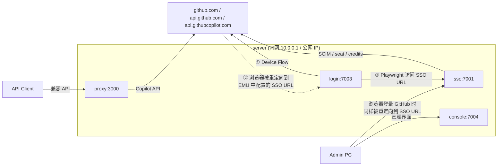

# 部署网络环境说明

本文只讨论**网络链路**：各服务监听在哪里、谁需要访问谁、哪些端口需要对外开放。密钥、证书内容、GitHub 侧的账号配置不在本文范围内，请参考 [guidance.md](./guidance.md)。

## 1. 拓扑总览

典型部署为一台服务器（下文以内网 IP `10.0.0.1` 为例，另有一个公网 IP 用于出网），通过 Docker Compose 运行 4 个容器。外部参与方有三类：GitHub（`github.com`）、管理员的 PC（Admin PC）、调用兼容 API 的客户端（Client）。



**浏览器如何找到 sso：GitHub EMU 中的 SAML 配置**

图中 ②、③ 以及 Admin PC → sso 的地址，都不是 login 或管理员自己决定的，而是来自 GitHub Enterprise 的 EMU SAML 配置。GitHub 在用户登录时把浏览器跳转到这里填写的 IdP 地址：

| GitHub EMU SAML 配置项 | 取值 | 说明 |
| --- | --- | --- |
| Sign on URL | `<SSO_PUBLIC_BASE_URL>/sso` | 登录时 GitHub 让浏览器跳转到的地址，即图中 gh.com 下方标注的 `Sso:7001` |
| Issuer | `<SSO_PUBLIC_BASE_URL>/metadata` | sso 服务作为 IdP 的标识 |
| Public certificate | sso 的 SAML 签名证书 | 与网络无关，此处仅列出 |

`<SSO_PUBLIC_BASE_URL>` 就是 `.env` 中的同名变量，例如 `http://10.0.0.1:7001`。它需要与 `.env` 中的 `LOGIN_SSO_URL`（`<SSO_PUBLIC_BASE_URL>/login`）保持同一 host/port。

登录时的实际链路：

1. login 容器内的 Playwright（或管理员的浏览器）打开 `github.com/login/device` 开始登录。
2. GitHub 识别出 EMU 账号，把浏览器重定向到 **Sign on URL**。
3. 浏览器在 sso 页面完成登录，sso 返回 SAML Response，由浏览器 POST 回 GitHub。
4. GitHub 验证后完成登录。

**核心结论**

- github.com 服务端**从不主动连接** sso，SAML 交互全部经浏览器中转，所以 `sso:7001` 不需要公网入站。
- `sso:7001` 的访问者是**执行登录的浏览器**：login 容器内的 Playwright（必需），以及管理员自己的浏览器（否则管理员无法在自己 PC 上登录 GitHub，只能 ssh 到服务器借 login 服务登录）。
- `SSO_PUBLIC_BASE_URL` 虽然名字带 "PUBLIC"，实际要求只是能被上述浏览器访问。
- 只有 `proxy:3000` 的暴露范围由“API Client 在哪里”决定；`login:7003`、`console:7004` 只需内网/VPN 可达。
- 所有容器都需要**出网**访问 `github.com`、`api.github.com`、`api.githubcopilot.com`。

## 2. EMU SSO URL 的选择

由 §1 可知，Sign on URL（即 `SSO_PUBLIC_BASE_URL`）需要**同时被 login 容器和 Admin PC 访问到**。可选方案：

| 方案 | SSO URL 示例 | login 容器 | Admin PC | 说明 |
| --- | --- | --- | --- | --- |
| 服务器内网 IP | `http://10.0.0.1:7001` | 可达（通过宿主机映射端口） | 同一内网/VPN 内可达 | 最简单，推荐 |
| 内网主机名 | `http://sso.internal:7001` | 需要在 compose 中为 `login` 配置 `extra_hosts` 或内网 DNS | 需要内网 DNS 或 hosts | 便于以后迁移 IP |
| Compose 服务名 | `http://sso:7001` | 可达 | **不可达** | 管理员只能 ssh 到服务器登录 |
| 公网地址 | `https://sso.example.com` | 可达（需出网） | 可达 | 需要把 7001 暴露到公网并配置 TLS，仅在管理员分布在公网时考虑 |

配置时需要保持一致的三处：

1. GitHub EMU SAML 设置中的 Sign on URL / Issuer。
2. `.env` 中的 `SSO_PUBLIC_BASE_URL`（决定 `sso` 生成的 metadata、Issuer、SSO URL）。
3. `.env` 中的 `LOGIN_SSO_URL`（host/port 与上面一致）。

## 3. 端口暴露范围建议

| 端口 | 建议暴露范围 | 理由 |
| --- | --- | --- |
| `3000` (proxy) | 按 Client 所在网络决定：内网、VPN 或公网 | 唯一面向业务调用方的入口 |
| `7001` (sso) | 内网/VPN | 需要被 login 容器和 Admin PC 的浏览器访问；不需要公网 |
| `7003` (login) | 仅本机或内网 | 只有 proxy/console 通过内部网络调用；宿主机映射仅用于健康检查/排障 |
| `7004` (console) | 内网/VPN | 管理入口 |

如需把某个端口限制为只在宿主机或指定网卡上监听，可以在 [docker-compose.yml](../docker-compose.yml) 的 `ports` 中指定绑定地址，例如：

```yaml
    ports:
      - "127.0.0.1:${LOGIN_PORT:-7003}:7003"   # 仅本机
      - "10.0.0.1:${CONSOLE_PORT:-7004}:7004"  # 仅内网网卡
```

注意：如果 `sso` 绑定到 `127.0.0.1`，login 容器就无法通过 `10.0.0.1:7001` 访问，EMU SSO URL 需要相应调整（见 §2）。

防火墙 / 安全组参考规则：

| 方向 | 源 | 目标端口 | 动作 |
| --- | --- | --- | --- |
| 入站 | Client 网段 | `3000` | 允许 |
| 入站 | 管理员网段 / VPN | `7001`、`7004` | 允许 |
| 入站 | 其他 | `3000`、`7001`、`7003`、`7004` | 拒绝 |
| 出站 | server | `github.com:443`、`api.github.com:443`、`api.githubcopilot.com:443` | 允许 |

## 4. 部署前网络检查清单

- [ ] 服务器可出网访问 `github.com`、`api.github.com`、`api.githubcopilot.com`（443）。
- [ ] 在 login 容器内能访问 EMU 配置的 SSO URL：
  `docker compose exec login node -e "fetch('http://10.0.0.1:7001/healthz').then(r=>console.log(r.status))"`
- [ ] 在 Admin PC 浏览器中能打开同一个 SSO URL（应看到 sso 登录页）。
- [ ] Admin PC 能打开 `http://10.0.0.1:7004`（console）。
- [ ] Client 所在网络能访问 `http://10.0.0.1:3000/readyz`。
- [ ] `SSO_PUBLIC_BASE_URL`、`LOGIN_SSO_URL`、GitHub EMU SAML 中的 SSO URL 三者一致。
- [ ] 在服务器上运行 [scripts/validate-health.sh](../scripts/validate-health.sh)，四个服务健康检查全部通过。
